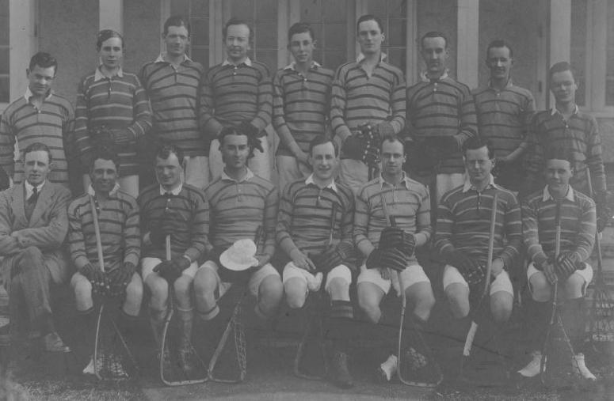

\
*Back:* W.Wagstaff, E.L.Bolton, R.A.H.Batchelor, S.H.Keech, J.W.Taylor,
G.Robertson, L.E.Jermy, L.W.Edwards, G.A.Greene\
*Front:* E.H.Smith, A.T.Hodgson, V.B.Pike, R.S.Dolleymore, M.W.Sutton
(Capt.), L.O.Thornbery, F.D.Ewen, J.V.Bannehr
