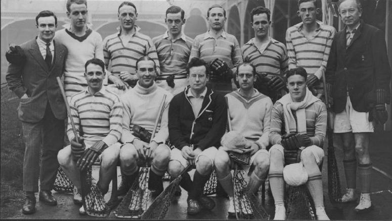
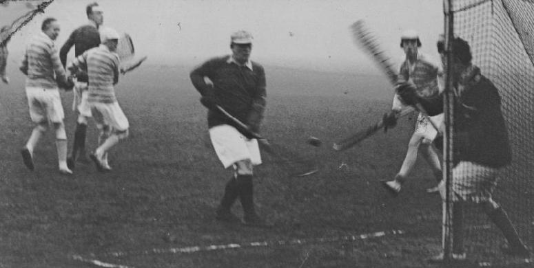
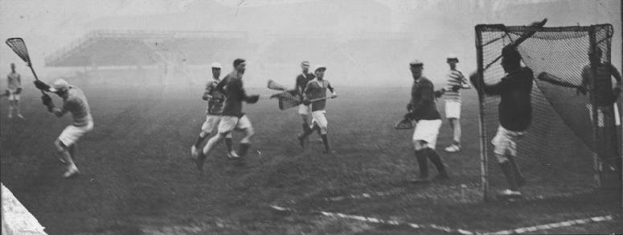

\
*Back:* J.W.Gary, L.Miller, H.S.Atfield, W.Walker Baird, E.L.Bolton,
G.A.Bryan, J.W.Taylor(?), S.H.Keech\
*Front:* A.T.Hodgson, R.S.Dolleymore, F.D.Ewen, L.O.Thornbery, J.Bannehr

---

\
Action in front of Purley's goal

---

\
Ewen (the Purley Captain) saves a difficult shot\
*Other Purley players (left to right):* Taylor, Atfield, Bolton, Miller &
Keach
