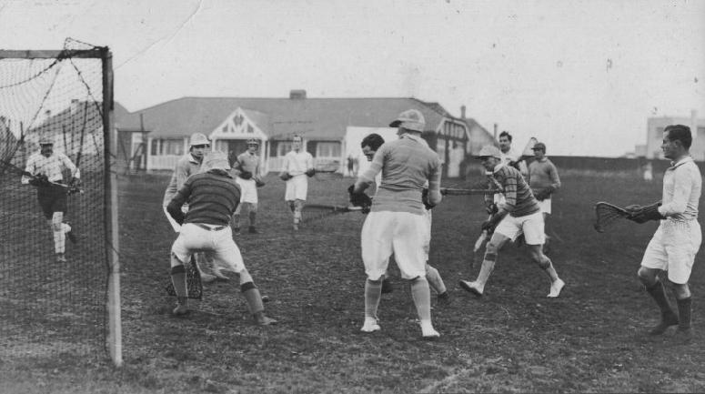
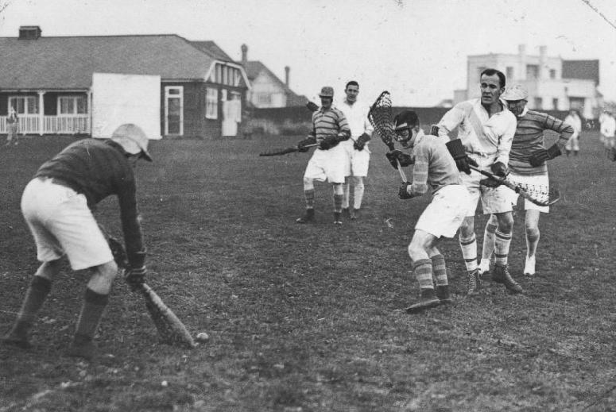

\
Purley's goalkeeper saves an unexpected shot\
*Purley players:* J.C.Goodwin, Healey (goal), Baldwin, Hodgson, Massie,
N.Smith

---

\
Healey saves a ground shot\
*Purley players:* Bunyard, Baldwin, Massie
