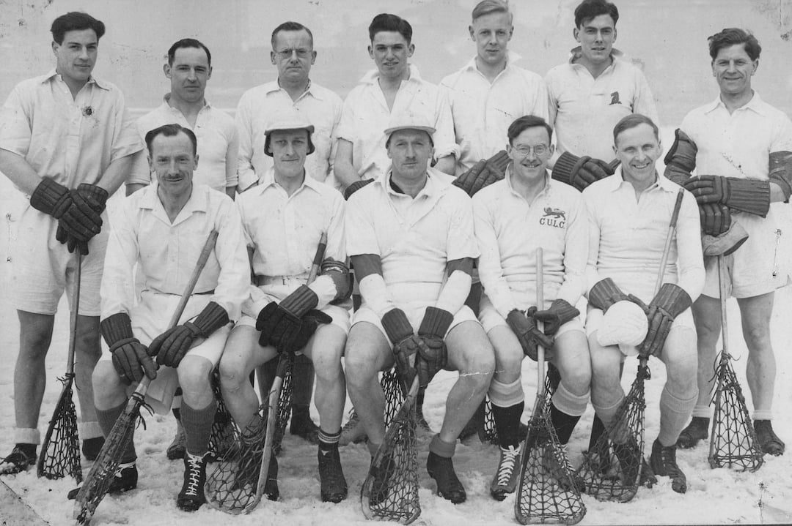

The South team which lost 16-8 to the North

\
Back row: D.Zimmern (Hampstead), A.Shewell (Catford), F.Ewen (**Purley**), G.Metcalfe (**Purley**), J.Eastwood (Cambridge Univ), A.L.Dennis (Cambs), J. Swindells (Hampstead)\
Front row: A.B.Maddocks (Hampstead), G.Forster (Old Dunstonians), N.Robson (Hampstead, Capt), A.M.Harker  (Hampstead), F.G.Moult (Buckhurst Hill)
