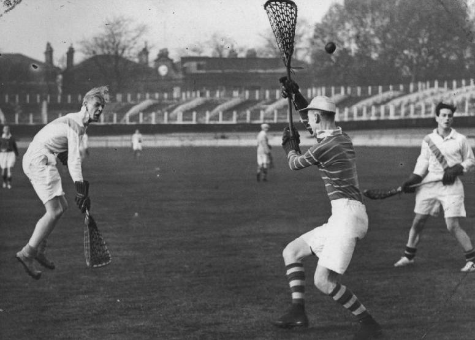
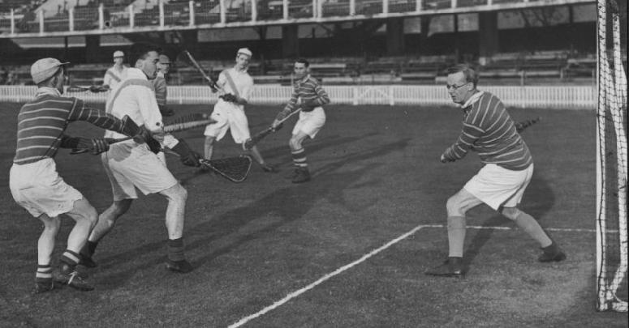
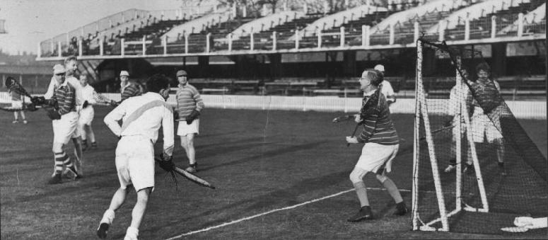
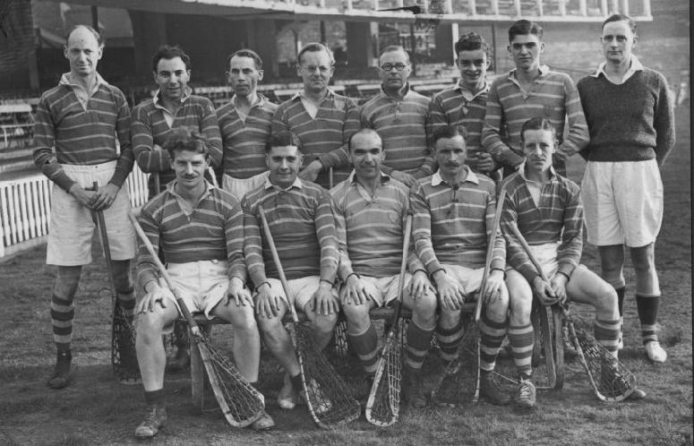

\
A fine action shot of Eastwood (left) shooting for goal

---

\
Ewen in the Purley goal watches Mash check Shercliff

---

\
Action in front of the Purley goal

---

\
*Back:* R.Stokes, J.Jemmett, G.Goodwin, F.D.Ewen, N.Smith, A,Debonnaire,
G.Metcalfe, A.R.Mollett (referee)\
*Front:* R.Privett, L.H.Bristow, E.E.Jones, W.E.Walker, F.Marsh
