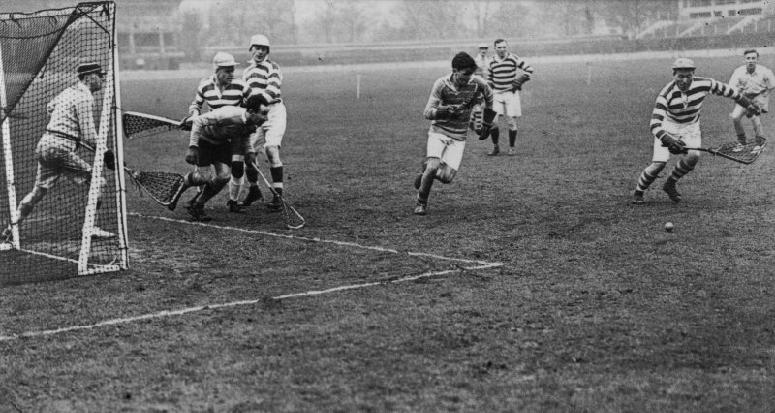
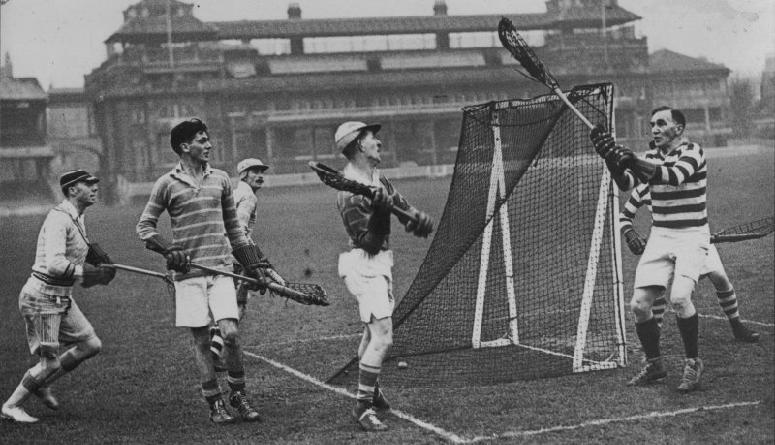
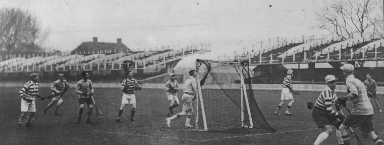
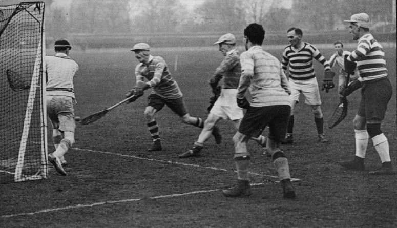
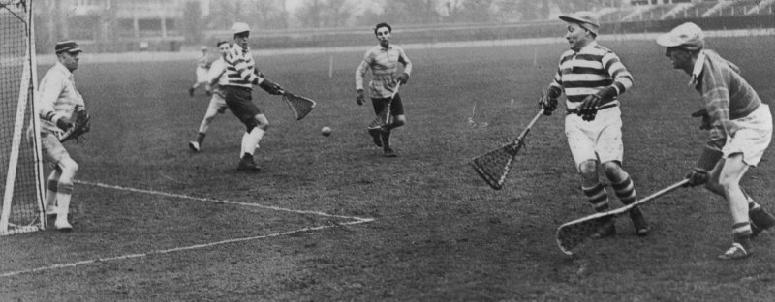
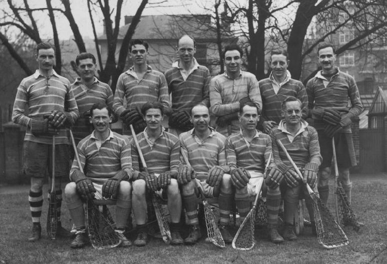

\
All eyes on the ball

---

\
Purley attack from behind goal

---

\
*Left to Right:* Court (L), Price (L), Jemmett (P), Milstead (L), Jones
(P), Humphries (L), Butt (L), Spicer (L), Walker (P), Bristow (P)

---

\
Walker scores for Purley

---

\
A loose ball in front of the Lee goal after a hard shot from the wing

---

\
*Back:* Walker, Bristow, Metcalfe, Stokes, Jemmett, Marsh, Kirkman\
*Front:* J.C.Goodwin, Privett, Jones (Capt.), G.Goodwin, Ewen
