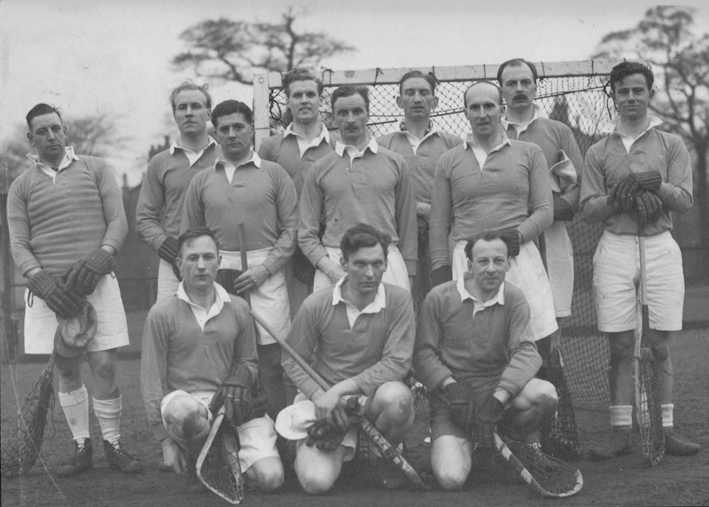

The South team which lost 18-4 to the North at Heaton Mersey.

Back row: Coppock (**Purley**), Miles (**Purley**), Marland (Cambridge Univ.), Heath (Lee), Sizmur (Old Dunstonians), Chilton (Cambridge Univ.)\
Centre: Bristow (**Purley**), Walker (**Purley**, Capt.), French (Old Dunstonians)\
Front: Gould (Lee), Gregory (Old Thorntonians), Johnson (**Purley**)
