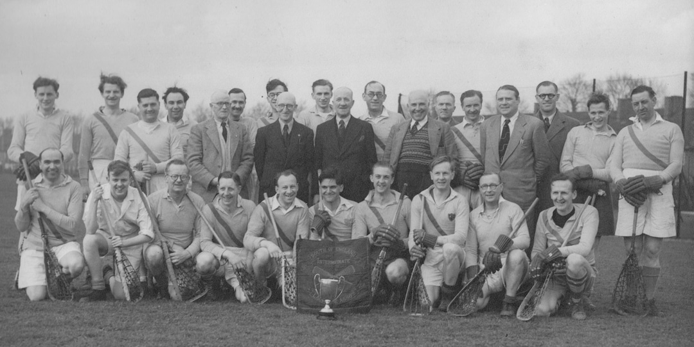
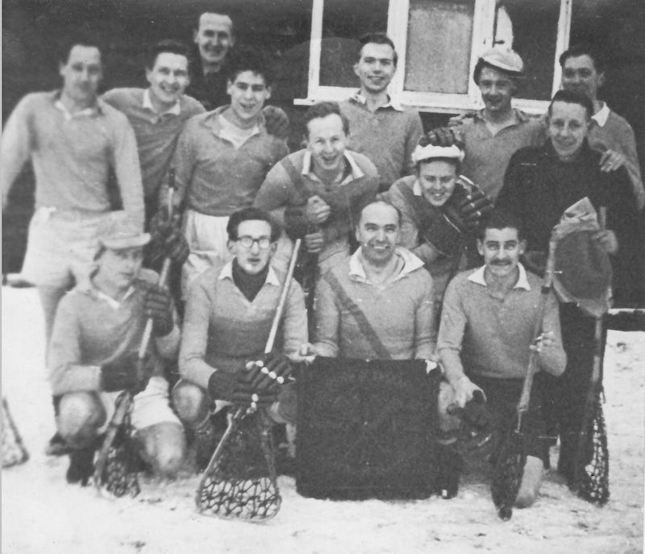

\
Club Photo\
Back row: S.Smith, R.Privett, L.Bristow, J.Jemmett, W.G.Walker, F.Kirkman, D.Ewen, W.Hickey (Australian Lacrosse Association), K.Last, T.D.Marshall, R.Marsh, A.T.Hodgson, F.Pamment, E.Walker, G.England, J.Lee, K.West, D.Coppock\
Front row: E.Jones, M.Tomkins, F.D.Ewen, F.Marsh, A.Johnson, G.H.Melcalfe, A.Phillips, P.Mundy, N.Smith, G.A.Oddy\
Trophies: Intermediate Flags and Six-a-side Cup

---

\
With the Intermediate Flags