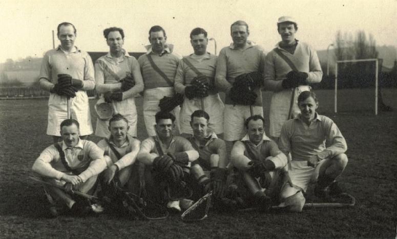

This newspaper report was printed at the time - though I'm not sure which
paper it was in.

## The Senior Flag Final

The South of England Men's Lacrosse Association Challenge Flag is now, for
the first time, the proud possession of Purley Lacrosse Club. They beat
Cambridge University by 8-7 at the Chislehurst and Sidcup County Grammar
School ground on Saturday, and so join Buckhurst Hill as the only two
existing clubs to have won the senior, intermediate, and junior flags
during their history. Purley are also virtual winners of the Southern
Senior League Championship cup this season.

The final was played under bright conditions and on firm ground. Purley's
attack was well held, the first quarter ending 2-2. Flag final nerves
affected play, but Purley were leading 4-3 at half-time. Cambridge
attempted to eclipse R. V. Wilson and G. Metcalfe, and did well, but J. R.
Church found the hard ground more to his liking as do all Australian
lacrosse players. At three quarter time Purley led 6-3. The final quarter
was the most interesting when Cambridge livened up to level at 7-all in
grand style, but Church kept up his assiduous play and scored the winner.
Cambridge pressed hard but could not equalize, their finishing being below
normal. Church (four), Wilson (three), and Metcalfe scored for Purley, and
Marland (two), Thorp, Robson, Shercliff, Thornburn, and Gooddie for
Cambridge.

---

\
*Back:* F.Bream, J.Jemmett, D.Coppock (Capt), L.Bristow, G.England,
R.Privett\
*Front:* E.Walker, J.Church, G.Metcalfe, F.Marsh, A.Johnson, R.Wilson
