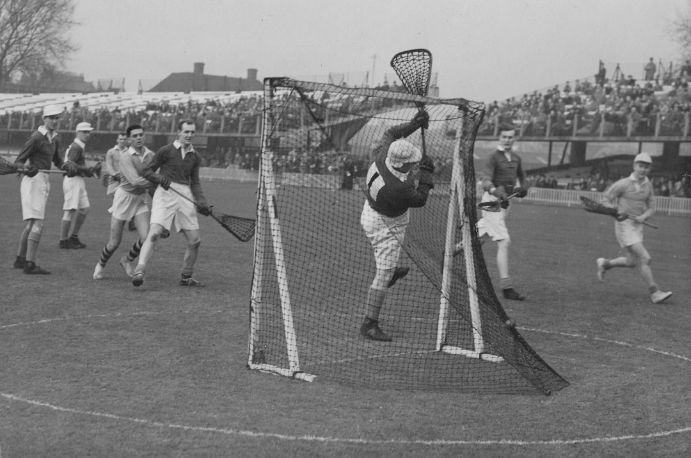
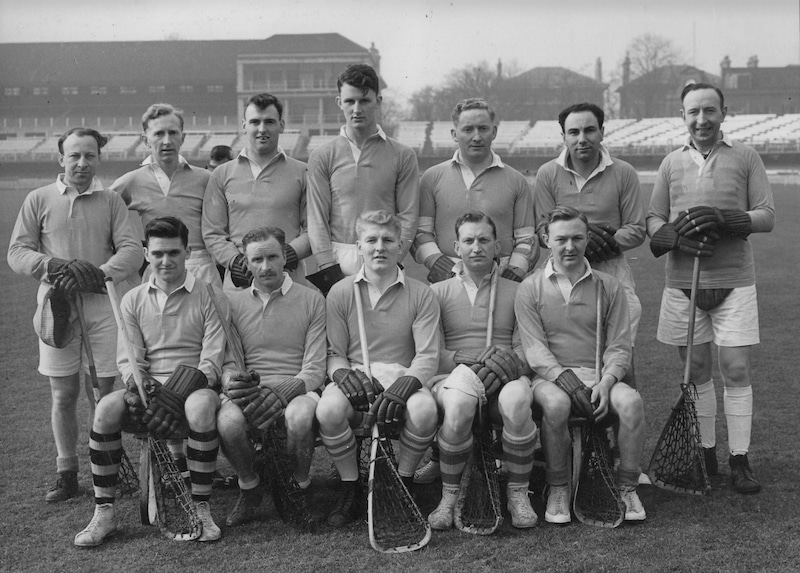

South lost 17 - 4.

\
Jack Church (Purley), extreme right, scores for the South. Others in the picture are
(left to right, South light shirts): D.Booth, D.Flunder, J.Gray, G.Metcalfe, A.Clayton, J.Griffith, F,McClinton.

## South Team, March 1953

\
Back Row: A.Johnson (**Purley**), A.Grant (Lee), J.Gray (Buckhurst Hill),
P.Robson (Cambridge Univ.), A.Picton (Beckenham),
J.Jemmett (**Purley**), D.Drake (Old Thorntonians)\
Front Row: G.Metcalfe (**Purley**), E.Walker (**Purley**), M.Pitt (Cambridge, ex-Purley, Captain),
R.Heath (Lee), J.Church (**Purley**).

Below is an article which we believe is from The Times, but we're not sure.

## LACROSSE WIN FOR THE NORTH

### LIVELY GAME AT LORD'S

FROM OUR SPECIAL CORRESPONDENT

The North beat the South by 17 goals
to four at Lord's Cricket Ground on
Saturday, in a delightful, lively game to
be remembered for the South's spirited
opposition. It was the sixtieth match.

Keen, good lacrosse was played, in which
the skill, timing, and cleverness of the North
attacks were especially entertaining. The South
instilled a liveliness into their play that was
most refreshing. Their attack held the ball
longer than the North, but could not finish.
Church and Metcalfe worked hard, but the
North defence covered and regrouped
efficiently. Kershaw and Gibson were the
most elusive North attacks. The South attack
could have passed the ball more, and did not
use Gray at centre enough.

The third period was the closest and most
exciting. The South gained ascendancy in
grand style, often piercing the North defence
and frequently gaining the loose ball. On
defence the South split up several thrusts and
cleared well. Gray and Metcalfe added fine
goals for the South and Gibbon for the North.
In the final period the South fought doggedly,
but the tiring defence found Gill a problem,
and he scored rapidly.

Clayton and McClinton were towers of
strength on the North defence and Griffith
was unshakable in goal. Noticeable was tne
energetic play of Jemmett and the centre play
of Gray, who gained tne ball from most of
the faces. The South made one change, bringing
in A. Grant (Lee) to replace R. V. Wilson
(Purley), who was indisposed. The North's
scorers were:- E. R. Kershaw (5), S. Gill (5),
A. Gibson (5), J. Buckland, and D. Flunder.
For the South, J. R. Church (2), G. H.
Metcalfe, and J. Gray scored.

NORTH.— J. Griffith (Stockport), F. M. McClinton (Old
Hulmeians), D. N. Booth (Stockport), A. B. Clayton (South
Manchester the Wythenshawe) (captain). E. R. Tweedale
(Heaton Mersey), B. Hatton (Cheadle Hulme), D. Flunder
(Old Hulmeians), J. Buckland (Old Hulmeians), A. Gibbon
(Heaton Mersey), D. H. Bennett (Old Mancunians), S. Gill
(Old Hulmeians), and E. R. Kershaw (Offerton).

SOUTH.— E. L. D. Drake (Old Thorntonians), A. Picton
(Beckenham). R. B. Heath (Lee). M. J. Pitt (Cambridge
U.) (captain). P. N. Robson (Cambridge U.), J. Jemmett
(Purley). J. Gray (Buckhurst Hill). W. E. Walker (Purley),
A. Johnson (Purley), G. H. Metcalfe (Purley), A. Grant
(Lee), and J. R. Church (Purley).

After the game the.England selectors met to
select the 1953 England XII. They will not,
however, meet The Rest in Manchester on
April 11. It is hoped the match will take
place during the Coronation festivities. The
English Lacrosse Union decided to make the
date flexible to help the northern league programme,
affected by the hard winter, to be completed.

The England XII will be:-\
J. Griffith (Stockport), F. M. McClinton (Old Hulmeians),
B. C. Makin (Old Waconians), A. B. Clayton (South
Manchester and Wythenshawe) (captain), P. N. Robson
(Cambridge U.), B. Hatton (Cheadle Hulme), G. H.
Metcalfe (Purley), J. Buckland (Old Hulmeians), A. Gibbon
(Heaton Mersey), D. H. Bennett (Old Mancunians), S. Gill
(Old Hulmeians), and E. R. Kershaw (Offerton).
