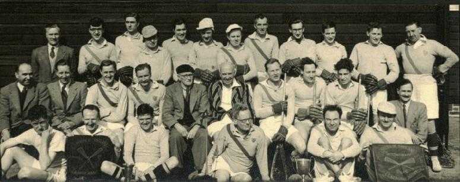

## Winners Senior, Intermediate and Junior Flags, Senior and Junior Championships

\
*Back:* F.Pamment, D.Ewen, W.Briggs, L.Cutler, R.Drawater, F.Simpson,
M.Tomkins, B.Last, A.Hill, K.West, S.Smith, D.Coppock\
*Centre:* E.Jones, F.Marsh, R.Wilson, E.Walker, W.G.Walker, A.Hodgson,
P.Mundy, D.Neeld, P.Patterson, F.Kirkman\
*Front:* C.Smith, G.Oddy, G.Metcalfe, F.Ewen, J.Jemmett, R.Privett

---

A couple of newspaper reports document a season which will probably never
be beaten.

## Purley's Splendid Season

Purley Lacrosse Club will go down in the annals of South of England
lacrosse as the first club to win all three flag trophies in a season since
flag matches were begun in 1884. By beating Oxford University 17-6 at the
Chislehurst and Sidcup County Grammar School ground, Footscray, on
Saturday, they retained the senior flag won there last year when Cambridge
were runners-up. They won the intermediate flag on February 21, and the
junior flag on February 14.

The final was played in ideal conditions, but the uneven hard surface
occasionally affected picking-up. Purley's speed, skill, and drive were
beautifully demonstrated in the first quarter, at the end of which they led
8-1. The Oxford defence, who lacked Higgins, had no answer. In the second
period, however, Wilkinson rallied Oxford and checked Purley's advance,
both sides scoring four each for Purley to lead 12-5 at the interval. In
the third quarter play was robust, and Oxford pressed, but the Purley
defence held, of whom F.Marsh marked Rosier well. Oxford also missed
Chouinard on attack. They did not score, but Purley added two. In the final
period Oxford tired and Purley mastered the play, adding three goals to one
from Oxford. For Purley Metcalfe played brilliantly. Their scorers were
Wilson (7), Metcalfe (5), Johnson (2), Church (2), and Walker. Rosier (4),
Lawrence and Davidson scored for Oxford.

| Southern Senior Championship | P | W | D | L | F | A | Pts |
| ---------------------------- | - | - | - | - | - | - | --- |
| Purley | 12 | 12 | - | - | 224 | 75 | 24 |
| Hampstead | 11 | 8 | - | 3 | 100 | 80 | 16 |
| Buckhurst Hill | 11 | 6 | 1 | 4 | 128 | 93 | 13 |
| Lee | 9 | 5 | - | 4 | 98 | 83 | 10 |
| Kenton | 12 | 5 | - | 7 | 82 | 78 | 10 |
| Old Dunstonians | 11 | 3 | 2 | 5 | 84 | 97 | 9 |
| Old Thorntonians | 11 | 1 | 2 | 8 | 45 | 153 | 4 |
| Purley A | 9 | - | - | 9 | 24 | 126 | - |

---

## Purley's Triple Success

Purley beat Oxford University 17-6 in the final of the South of England
Senior Flags lacrosse competition at the Chislehurst and Sidcup School
ground, Footscray, Kent, on Saturday, and so hold the trophy for a second
year. Purley thus have created a record by being the first to win the
senior, intermediate, and junior flags in the same season since the
competitions began in 1884.

The final was well attended and played in ideal conditions. Oxford seemed
tired after their hard game with Cambridge on the Thursday and also missed
Higgins on defence and Chouinard on attack. Purley did not have Bristow on
defence, but opened in brilliant style and combined on attack at such speed
that Oxford could not control them. At quarter-time, indeed, Purley led
8-1. Oxford fought back, but Purley led 12-5 at the interval. Play was
lively and robust in the third period, during which Oxford pressed again.
Purley's defence held, however, F. Marsh's marking of Rosier being
particularly good, and at three-quarter time Purley led 14-5. In the final
period Purley's fine attack and hard tackling had so tired Oxford that they
were able to add three more goals to Oxford's one.

G. Metcalfe was outstanding in Purley's attack and S.B. Rosier was the best
of Oxford's, but lacked support. Purley scored through Wilson (7), Metcalfe
(5), Johnson (2), Church (2), and Walker, and Oxford through Rosier (4),
Lawrence, and Davidson.
