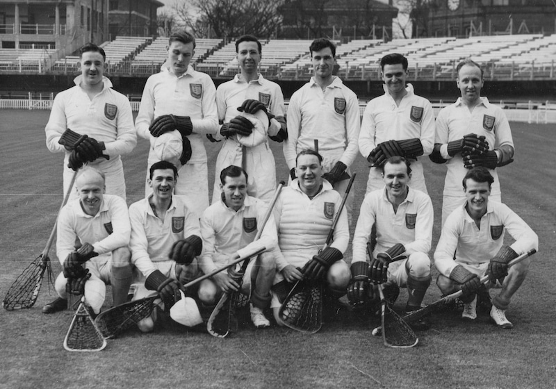

## England at Lord's

\
Back row: D.Walkden (Old Waconians), F.M.McClinton (Old Hulmeians), E.Tweedle (Heaton Mersey), D.Booth (Stockport), G. Metcalfe (**Purley**), H.Whatley (Old Hulmeians)\
Front row: W.Crofts (Boardman & Eccles), E.R.Kershaw (Offerton), J.Buckland (Old Hulmeians), J.Griffith (Stockport), A.Clayton (South Manchester and Wythenshawe), A. Gibson (Heaton Mersey).

## ENGLAND'S ATTACK MORE THRUSTFUL AND DIRECT

From our Lacrosse Correspondent

England beat the Rest 16-4 in a representative
lacrosse match at Lord's after
a fast and interesting game. Perfect
weather and an ideal playing surface
provided faultless conditions and the
England side, which was as selected, outclassed
the Rest. whose team included
Bradburn for Zizmor on defence and
C. S. Smith for Gill on attack.

The Rest defended keenly at the start
and England opened the scoring through
Buckland only after some time. Slowly but
surely however, England established a
superiority and at half time led by 7-2.
The game was played in two halves of 45
minutes instead of in the customary four
periods of twenty minutes. The second
half opened evenly and an early goal by
Gibson was quickly followed by one from
Gray for the Rest. England's attack then
confirmed its superiority by scoring seven
goals before the Rest could reply

A marked contrast in methods of attack
was the game's most notable feature.

\[Note: the right hand of this column of the article was frayed. We added what seemed to be the correct text, and marked any missing text with square brackets.\]

Whereas England's attacks constantly
endeavoured to score by combined thrust
which moved directly towards goal,
Rest's attack kept the ball moving wide with
frequently combined movements ending
with the ball farther from goal than it was
when such movements began. The difference
in the quality of defence play contributed
to this contrast. England's defence
was excellent and Griffith's polished
play of goalkeeping gave the Rest's attack
no encouragement ; McClinton, who cleared
well, and Clayton also were outstanding.

In England's attack Buckland, who with
five goals was in his best form ; his passing
was particularly accurate and contributed
to all of the three goals scored by Crofts
and most of the six scored by Gibbons.
Kershaw also scored twice for England.
The Rest's defence played hard but were
never equal to its task ; Thorpe was the
outstanding defender. Gray, who \[sho... - "shot most"?\]
goals, played well and tirelessly at centre,
and Ringham, who also scored twice, was
the most dangerous of a Rest attack of
which C. S. Smith was the hard worker.
