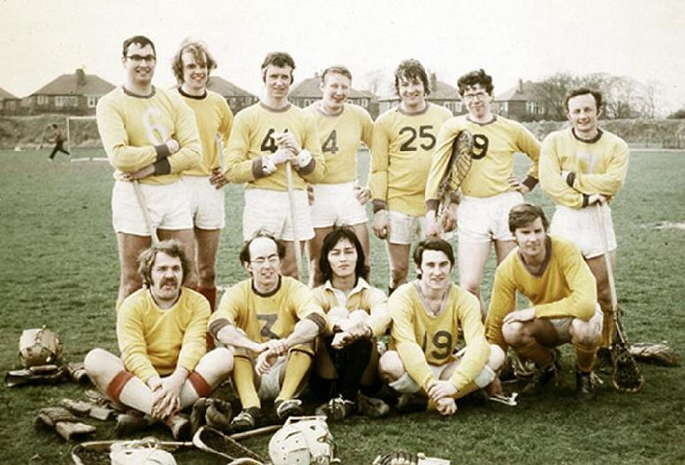

\
*Back:* Dave Leppard, ?(1), John Heywood, Ian Thorley, Geoff Cattle, ?(2),
Ray Wilson \
*Front:* Phil Davey, Glynn Thatcher, ?(3), Roger Oliver, Geoff Treloar

Thanks to Ray Wilson for the picture

## Player Bios

| Player | Info |
| ------ | ---- |
| Dave Leppard | Defence player who played for Purley for many years. |
| ?(1) | played in mid-field. |
| John Heywood | Attacking mid-field player who joined Purley from St Helier. |
| Ian Thorley | Vice-captain and defence player who joined Purley from Offerton. Ian has lived for many years in Germany |
| Geoff Cattle | Attack player who played for Purley for many years. |
| ?(2) | attacking mid-field player - a Northerner who joined Purley after playing for Oxford University. |
| Ray Wilson | Captain. Attack player. Played for several sides before Purley including Stockport and Leeds U |
| Phil Davey | Goalkeeper who joined Purley from Lee. |
| Glynn Thatcher | Another stalwart defence player who represented Purley for many years. |
| ?(3) | Japanese played in mid-field. |
| Roger Oliver | Defensive mid-field. Another Purley stalwart. |
| Geoff Treloar | Very forceful attacking mid-field player. Australian. Played for Purley for a couple of years before returning home. |
