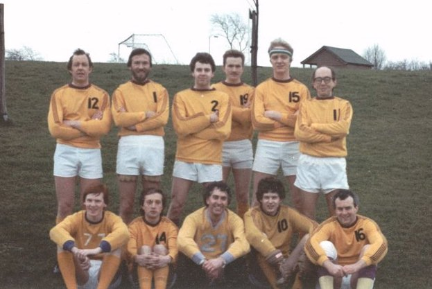

\
Purley 16 - Beckenham 8\
**Purley 'A' Team**\
*Back:* Colin "Lew" Lewis, Martin Tringham, Tim Murphy, Colin ?, Ray Birch,
Glyn Thatcher\
*Front:* Richard Ellison, Martin Little, Jeff Lee, Pete Metcalfe, Gus Govus
(Capt.)

Regular Purley 'A' team captain Tony Brown managed to miss the final by
being away skiing (its amazing at how many lacrosse players forget when the
Flags finals are - Ed). However, this made the victory all the more sweet
for his replacement for the day, Gus Govus, who before moving to Purley had
spent 14 seasons playing for Beckenham.
