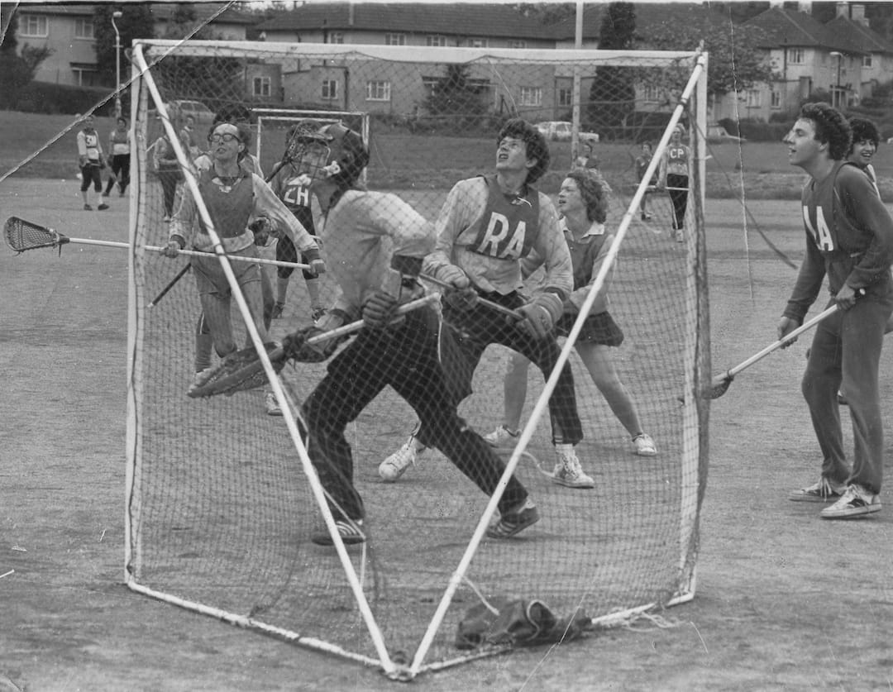
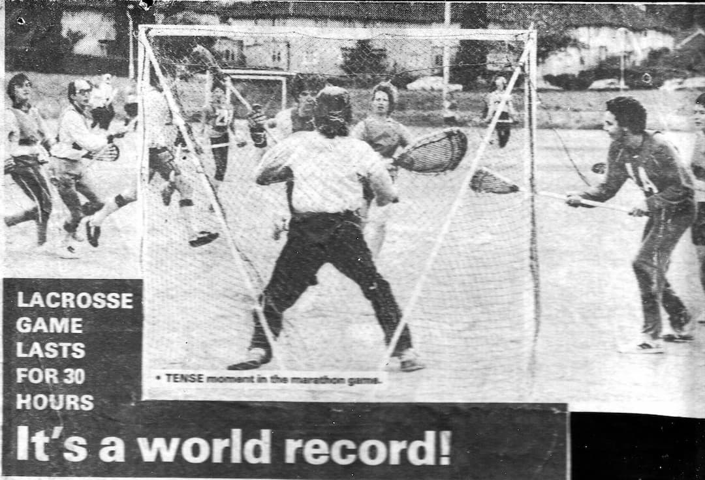

The game took place over the weekend of the 14th-15th June 1980.

\
Glynn Thatcher (glasses), Pete Metcalfe (RA), Tim Murphy (LA), Steve Cattle (behind Tim)

Below is an article which we believe is from the Croydon Advertiser.

by Jane Hodgson

LACROSSE players set
а пеw world record for
30 hours non-stop play
in a sponsored game that
started on Saturday
night at Monks Hill
Sports Centre, South
Croydon.

It's the first record ever set
for a mixed game — Purley
Lacrosse Club being the only
mixed club th the world \[Ed: almost certainly this wasn't true\] — and
it's also the longest match
recorded in the world.

A member of the club, and
member of the English
Lacrosse Union, the national,
co-ordinating body, Mr Stan
Smith, said "As far as we
know it's a new world record
because nobody has done it on
a mixed basis and on one club
basis before."

The previous record for
the longest game was a men's
match of 24 hours by the
England squad organised by
Mr Smith in 1978.

"The Guinness Book of
Records," though, do not accept
these matches as records
— international lacrosse rules
allow for 12 substitutes on each
team, but the book's editors
stipulate no substitutes in a ten
a side match.

The assistant sports editor,
Beverley Waites, said "It's
certainly the longest match I've
heard of, but our rules for a
marathon game are that there
are no substitutes."

Club members say this
doesn't disappoint them.

Miss Carole Cameron, one
of the 42 players in the game
held on the outside pitch at the
sports centre, Farnborough
Avenue, Sanderstead \[actually Monks Hill, Selsdon\], said: "I
didn't do it for that kind of
recognition — I did it to raise
money for Help a London
Child."

And president of the club
and referee for some of the
match, Mr John Maynard, of
Addington Road, Selsdon, said
it had been a hard match and
he didn't think everyone could
have played for 30 hours non-stop.
The two mixed teams
played through downpours of
rain.

So that the match could be
held, the manager of the sports
club had to get special permission
from the council to keep
the floodlights on overnight.

Leader of the men's team,
Colin Little, said: "People
played until they were tired.
We didn't have set time limits
because some people are
stronger than others.

"The players ranged in age
from 14 to about 33.

"The club actually has 80
members but only the keenest
joined the match, and it ended
up with a nucleus of about 20
players on the pitch most of the
time, with others playing for
short, periods."

One player lasted nearly the
whole time — Philip Battershill,
of Meade Way, Shirley,
who played for 29 hours and 40
minutes.

Miss Cameron, leader of the
women's team, said: "During
the early hours of Sunday morning
we knew we just had to
keep going, It rained a bit and
was very gusty.

"Afterwards I felt elated
that I'd managed it, then I went
home and slept for 14 hours."

The club expects to collect
about £300 for Help a London Child.
