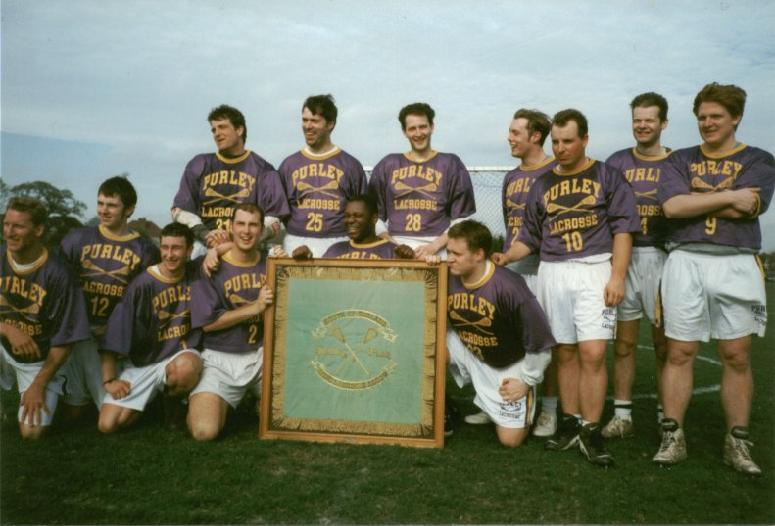

## Purley Break the Kenton Stranglehold

\
*Top:* Tim Richmond, John Savage, Dave Slaughter, Chris Spence, Darren
Novell, Adrian Shuker, Adrian Walters\
*Bottom:* Mark Gold, Dean Searle, Matt Payne, Mike Barrett, Mike Husey,
Graeme Holland

Janet Harrop reports from a thrilling Southern Flags which kept everyone on
their toes right to the final whistle.

The Southern Men's Flags Final between Purley and Kenton was a thoroughly
gripping match. These two have played each other twice this season, with
Kenton winning by two goals each match. By the end of the first quarter of
the Flags, it was beginning to look as if Kenton were going to win by
considerably more than two goals. Despite superb defence by Purley,
Kenton's John Jessop, Chase Tydings, Martin Duckworth and Pat Cunningham
between them had managed to put five goals past keeper Adrian Walters.
Purley had yet to score.

Purley's fortunes changed however at the beginning of the second quarter.
John Jessop had his second goal of the match disallowed when the Purley
coach requested a stick check on ]essop's stick. The stick was found to be
too short and not only was the goal disallowed, but Jessop incurred a
three-minute penalty. Purley were determined to take advantage of the
situation, Tim Richmond and Darren Novell both scoring past keeper Simon
Savage during the three minutes with the third of Purley's goals from
Graeme Holland following hard on their heels.

Having stopped the rot, the will of the Purley squad to win was almost
palpable. Their determination to maintain the momentum paid off with
Richmond scoring two more goals in the quarter. For Kenton, the incident of
the illegal stick when they were on a roll seemed to unsettle the squad
somewhat, and no one was able to break through the Purley defence. When the
whistle blew for half time the score was 5-all.

In the third quarter Purley seemed unstoppable. Matt Payne and Mark Gold
took the score to 5-8 but Kenton, seeing the Flags slipping away from them,
shifted up a gear and a real fight-back began, with Russell Croft, Martin
Duckworth and John Jessop (with a borrowed stick) bringing the score to
8-all by the end of the quarter.

With everything to play for, the standard of play in the fourth quarter was
truly spectacular, lacrosse at its very best. Tim Richmond scored twice for
Purley and Pat Cunningham once for Kenton, and up to the last few minutes
of the game it could still have gone either way. However, Darren Novell
scored again for Purley and in the dying seconds of the match Purley's Mark
Gold took the score to Kenton 9, Purley 12.

This victory was particularly sweet for Purley, as they are the first squad
for five years to deprive Kenton of the Flags. Added to that was the
knowledge that they were going into the match as the underdog. Kenton are
indeed a fine team and have not lost a league match since they lost to Bath
in February 1996.
