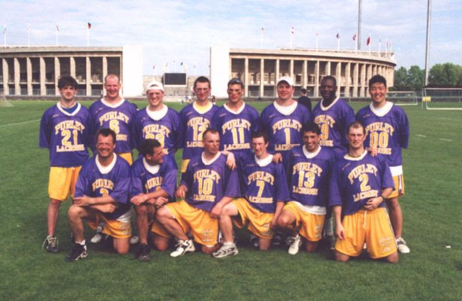
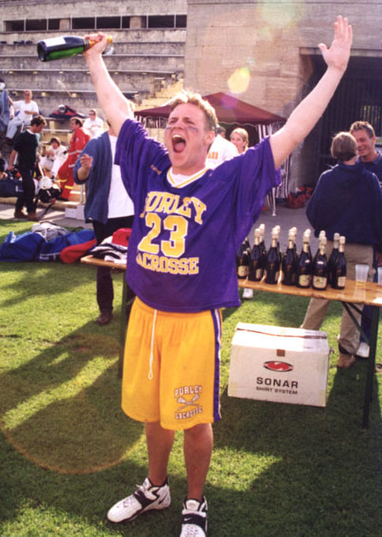

## A Weekend in Paradise

by Steve Kenward and Sedge Hahm

### Berlin Olympic Stadium 1999

\
*Top:* Tom Brown, Dave Arnot, Graeme Holland, Dean Searle, Denham Pope,
Paul Terry, Mike Husey, Sedge Hahm\
*Bottom:* Andy Booth, Bill Curtis, Darren Novell, Matt Payne, Steve
Kenward, Mike Barrett

### Day One

Following what can only be described as an 'entertaining' flight, followed
by an equally enthusiastic night at the bar, the Purple 'n' Gold headed for
the tournament with heads held...erm...anywhere there wasn't any sunlight.
However, a trek on foot that should've had a green beret waiting at the end
of it soon cleared away the fuzziness, and there we were .....in heaven: A
stadium, brilliant sunshine, music blaring out from large speakers, a beer
tent, the smell of cooking steaks, lacrosse players everywhere and above
all the inch-perfect grass of the pitches. It took half an hour just to
adjust to picking up ground balls without a pile of worm-casts in tow.

Well the Purley boys got off to a quick start in their first game against
the Czech team TJ Malesice (mallaseechie) - last year's Berlin Open Champs.
Three quick goals paced by Mike Barrett's strong face-offs had the Czechs
in disarray and Purley continued to pour it on to take a 5-2 lead...but
Malesice came back strong to tie it at 6-6, taking advantage of their fast
break skills, the Prague men turning into Gazelles every time they got the
ball. With less then a minute left in the game, the Czech National Petr
Tahal drove across the middle to score on a bounce shot to seal a 7-6 come
from behind win. It was a gut check for Purley - if they were to reach the
semis they could not afford any more set backs.

Purley's second game of the day pitted them against Sundyburg of Sweden.
The defeat by the Czechs would become a blessing in disguise as every team
was now viewed as an unknown quantity: We were not about to take them
lightly. As it turned out the Swedes were no match for the controlled
attack of Purley and goalie Paul Terry, and they quietly laid down their
arms to a 11-0 defeat.

By this stage, the paler members of the team were beginning to realise that
none of us had brought sunbloc and gradually sunburn began to add to the
list of aches and pains our bodies were creating. These were not
particularly short games at 15 minutes a quarter.

The last game of the first day was against Ingo Hess's perennial bridesmaid
team - VFK of Berlin. Standing by the pitch in wait for us, wearing black
shorts, grey tops and white cascades, they reminded me of stormtroopers. It
also dawned on us that there weren't many of them under 6' in height. Both
teams fought hard but Purley's skills were too much for VFK and their
frustrations manifested in a mild scuffle that broke out in the second
quarter. During a battle for a ground ball, Hess whipped his stick around
the head of Dave Arnot and Hess was charged with a two minute
unsportsmanship penalty. Unable to stop the barrage of shots from Purley,
VFK resorted to placing Hess in goal, but that move proved to be futile as
Dave Arnot's laser cranks continued the assault on the VFK goalies. In the
end the purple haze came out with a 13-1 victory, but what the German team
lacked in goals they made up for in physical violence.

And so to bed... you'd have thought so wouldn't you? Nope, following a
pasta frenzy the tournament's teams went to a sports bar where the World
Games of 1998 were constantly played (and re-played ...and re-played again)
on it's multitude of screens. Another early night for all concerned...well,
early in the morning.

### Day Two

Another glorious day of sunshine and warm weather welcomed the match with
Rheinland's 'Lancers' (made up of mostly Langenfeld players), but without
their starting goalie, Kyle Moore, who was knocked out with ligament
injuries to his shoulder. They were left with barely a glimmer of what
little hope they had. Once again the Germans proved to be big and fast but
the Purple machine's big guns came out firing and Tom Brown finally awoke
from dormancy to find the back of the net. Rheinland had systematically
been dismantled 14-1.

With Malesice, Munich and VFK doing well against the other teams, game two
of day two proved to be a must win for Purley as they faced last year's
runners up - LC Jizni Mesto of the Czech Republic. Again with the strong
face-offs from Mike Barrett, Purley jumped all over goalie Ladislav Cizek
to take a 5-1 lead, but once again the Czech's box lacrosse skills came
into the fore with strong mid-field play from Czech Nationals Pavel Dosl
and Josef Ondracek proving lethal on fast breaks. Jizni Mesto came roaring
back to tie the game at 5. A couple of more exchanges left Purley with a
hard fought 10-8 victory. We learnt that, almost to our cost, you couldn't
force things offensively against the Czech teams.

A relatively new German club from Hamburg did not prove to be much of a
challenge as Purley breezed through its last game of the day, the final
score being a lot of goals to zero. Bodies bruised and aching, legs begging
for mercy and 'the lobster factor' affecting everyone we prepared for the
3rd night out. A party in the basement of an old church that must have had
at least 300 people in it saw us through till the birds started
singing ...and then it was time for the finals.

### Day Three

With the round robin segment of the tournament completed the semi-finals
were set. Purley vs. Munich in the first semi-final and TJ Malesice vs VFK
in the other contest. Even a hard night of partying did not stop the Purley
machine as Munich were no match for Purley's run and gun. Joerg Rohaus and
"Korny" conceded the loss with barely a squeak, 15-3.

Inevitably, VFK were no match for the blue and yellow box team from Prague
and we were set to play not only the defending champs, but the one team we
hadn't beaten.

There was about an hour and a half to wait ...how does that Guinness advert
go? "..and let me tell you, tick followed tock followed tick..."

The stage was set for the championship match...

With the DJ apparently on a break, it was eerily quiet as the teams took to
the field, the Purley team eye-blacking up for the last time (it bloody
works!!) as the Czechs eyed us from the far end of the field. You could cut
the tension with a knife. The whistle blew and within 2 mins Malesice
scored. Undaunted, Bill Curtis won the ensueing face and blasted one
straight back at them. 1-1 and the game was set to be a shoot-out.

The Czechs had other ideas however, and refused to let us drop into the
settled formations we'd used to good effect the last time we'd played, each
man being very tightly marked. The result was that shots and passes started
getting forced and Malesice then demonstrated THEIR run 'n' gun, and it was
awesome. All too often our retreating midfield found itself watching a 40
yard bomb find it's way to a Cheetah with a stick. By half-time the score
was 5-1 to the boys from Prague and heads were down everywhere in the
Purple 'n' Gold camp. The huddle saw a decision where we let our defenders
mark us out of the game, and take them away from it as well. This paid off
as, following goals from Dave Arnot and Sedge Hahm we started clawing back.

The Czechs started losing their patience in defence, and a series of dodgy
checks gave us the man-ups we needed. With the scores at 5-4 Jimi Hendrix's
'Purple Haze' suddenly blared out over the speakers and, with Bill Curtis
and Mike Barrett dominating the face-offs, another goal saw the third
quarter end 5-5 with both teams fired up for the finale. But Malesice
weren't finished, and a battle of the two defences followed. Late in the
game however, both offenses became hungry for the winner with disastrous
results for the English side. Suddenly the Czechs were up 7-5 and there
were less than 3 minutes left.

Purley dug in, time running away from us. Mike Barrett won the face and
took the ball to the cage. With perfect timing he drew a defender and
dumped to Dave Arnot who fired the ball into the top-right corner of the
goal with about 1 min 30 left on the clock. Again we came up with the face,
Mike Barrett taking a shot this time that the Malesice keeper blocked,
Graeme Holland saw the loose ball in front of the goal, scooped it up and
buried it in the back of the net to a raw from the crowd (and the team).
7-7 with 45 seconds left in regulation time.

Mike Barrett wasn't done though. Again he won the face, ran it to the hole,
Graeme Holland popped up open on the crease, took the pass, faked the
keeper twice and slotted home the goal that put us in front for the first
time in the game with only 15 seconds left on the clock. Mike Barrett again
won the face and as the whistle went the party started. Sticks, gloves and
helmets everywhere as the whole team raced into the middle of the pitch.

3 days of shouting had left everyone a little hoarse but we had enough left
in us to give the Czechs the cheer they deserved. It was the first time in
5 years that someone had beaten them in Berlin.

There then followed the end of tournament presentations, given in German
and English by our Berlin Lacrosse hosts. The whole event had been held in
an excellent atmosphere and jokes and digs started flying round from all
the teams as the beer started to flow. The last word went to the referees
who, having done an excellent job all weekend, gave us their rendition of
'Swing low, sweet Chariot' which culminated in them clearing the way to the
champagne as about 6 teams charged forward.

We'd like to thank (again) the Berlin lacrosse men and women who organised
everything so well, and the rest of the teams from Germany, Sweden and the
Czech Republic who made the tournament what it was. With Lacrosse serving
as an interpreter there was no animosity, just players playing a game that
they all love, in a way that gave them pride, in a setting that couldn't
have been better in your dreams. As our chairman, Andy Booth, quoted at the
end of the tournament:-

> It's been emotional

\
Captain Graeme Holland celebrates with the bubbly
