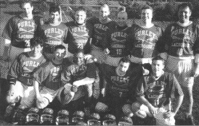

## Steve Kenward discusses what makes Purley tick

Southern Senior Flags Winners 1997, Premier League Champions 1998, Final
Four Champions 1998, average age of the team? About 23.

After some six years in the black shadow of Kenton, the winds of change are
carrying something new across the South. So what's inside the Purple Haze?

If you've ever read any of the Southern league reports, one word about
Purley keeps cropping up: cohesion. The fundamental reason we're playing so
well at the moment is the fact that everyone on the team

1. loves being a Purley player, and
1. displays an unashamed, almost (and I quote from an outside source)
child-like obsession with the sport.

It is this, coupled with the stingiest defence in the league and an
excellent run 'n' gun offence that has made the team what it is today.

## The Team

\
*Back row:* D Slaughter, M Gagliano, G Holland, M Barrett, D Novell, P
Terry, A Booth\
*Front row:* S Kenward, D Searle, M Husey, M Payne, D Pope

At the heart of the team is a group who were all England U19 players
(including Mike Barratt, now playing for England, Paul Terry for Wales),
covering every position including, rather handily, goalie. Add to that some
older vets who know a trick or two (including Wales' Darren Novell), and
build them all on cornerstone Andy Booth, formerly of League North and
England (now sponsored by KFC: four chicken burgers Andy!), and you've got
yourself a team which, when it plays well, can beat anyone (except at
modesty).

The older players help the younger ones keep their heads, and in turn the
younger players play with an enthusiasm that inspires the older ones. I'd
have used 'experienced' instead of older, but with Purley that doesn't
always go hand-in-hand.

Purley has also always had a strong tie with its LDOs from across the pond
(most of our subs go on them), who set excellent examples for us, and gave
us the aspirations of being just like the college sides that we watch
repeatedly on video tapes. They are an asset we'd recommend to any club.

An LDO a couple of years back, seeing our old yellow American Football
tops, sorted us out with an extremely smart new strip. Suddenly, Purley
looked like a proper team, something to take pride in. If you look like a
team, you play like a team. Look like individuals and you'll play like
them, it's all psychose-wotsaname. In the South, the worm started turning
(then dodged passed two defenders, faked the keeper and blasted a round the
shoulder shot to the top right corner).

## The Attitude

Purley have always believed the sport should appeal to people, to have it
played in front of crowds that aren't just friends and relatives. A
pipe-dream to some, but (quoting the Apple Macintosh advert) 'those who are
crazy enough to think that they can change the world, are the ones that
usually do'.

So when someone suggested getting new, matching helmets from the States we
all jumped at it. We're not made of money as a club, but £67 per helmet
(our LDO brought them back from his hols) was a small price to pay for a
club that now looks like we're playing for the '90s and beyond, something
young people will want to come and play.

Speed and skill are one thing but to today's youth, surrounded by designer
labels and glossy adverts, image is everything. Show a picture of a player
with a 1960s motorcycle helmet, knee-length socks and shorts that might as
well have 'Speedo' tagged on them, to a group of 16-20 year olds and
they're not going to listen to anything you say about lacrosse. They''ll
just tell you it looks crap - sad but true.

We know what the game's like, we saw the game and accepted it, but
remember, a picture (think advertising now) doesn't show a newcomer the
game, it shows them players, and they've only got your word that it's
manic. Show the same group of 16-20 year olds a picture from a recent US
college clash and I'd guarantee you'd generate interest. Why? Because it
looks new.

So we're saying we should all become Americans? No, but we think we should
be playing the game their way, because one day we'll beat them at it - and
anyone who disagrees with that attitude should go and watch any cricketing
nation play England.

## The Season

The last time Purley won the title most of the present team were still in
school! In fact only one member of the team survives, defender Dave
Slaughter (appropriate surname for a D-man). We knew the contest for the
championship was going to be interesting, with Kenton winning the league
last year and us winning the Flags, but the surprise team turned out to be
Hampstead.

Always strong when they get a team out, Chris Bland's men caught us out
twice this year, and seeing as we split the series two apiece it looks set
to become an excellent rivalry. The first meeting at Hampstead saw us win
21-12, Tim Richmond 'the thunder from down under' (who will be back next
season) putting nine goals in himself.

The next time we met was the flags semi-finals which, in a howling wind,
saw Messrs Bland, Tarpey and Symington dominate midfield and take advantage
of our defence's worst performance of the season. We rallied, but all too
late, finishing 17-15.

This game broke our winning streak. We had a chance for revenge in the
league at home, but again the elusive Bland & Co had us sussed, 14-9 this
time: the monkey was firmly on our backs.

It took us three-quarters of the final in the Final Four competition to
shake it, when from 4-1 halfway through the second quarter, we had it at
4-4 at the start of the fourth. Then the team just pulled together, and,
following what was in total nine unanswered goals, won it 10-4. I'm sure
both sides are going to go at it equally hard next season.

Our trip to Hillcroft this season had everyone psyched-up for the occasion,
them being tipped as our closest rivals. What we expected was going to be a
close game turned into a rout as our attack, led by Graeme Holland & Tim
Richmond, took the Hillcroft defence at speed, leading to a final score of
20-5. The return game, at the end of the season, saw us shut them out 10-0.

The other big clash was going to be Kenton. The first meeting, in that dark
land north of the river, saw us run away 18-5 winners, Graeme Holland again
leading the charge with six goals. Kenton's sortie south saw them make much
more of a fight, this time our defence led the way and we won 9-5. Kenton
still chased us up the Premier league table though, but Hampstead caught
them out too, and they ended up finishing third.

The real shock of the season came from Bath. Having taken a strong side
down the seemingly endless M4 and won 20-5 it was a complete reverse at
home. No subs and a couple of key injuries didn't help but Bath deserved to
win the game 11-8. Hitchin weren't so lucky on either occasion this season,
losing 14-4 and 18-4.

Out of the first division teams, Croydon put up the best fight against a
team that included some old second-teamers, most notably Tony Bennett 'The
Fossillator' (easily the oldest player in existence) in goal. He stood firm
and held them to seven goals to our 14. London University, Beckenham and
Tatsfield all followed suit. Sadly, we never got to play Buckhurst Hill and
Oxford University.

So things are changing in the South. Kenton, for the first time in what
seems like an age, have been beaten.

The Final Four is an excellent idea and one we'd recommend to League North.
It means that every team in the division has a realistic chance of making
it to a competition each year. So next year should be even closer.

We intend to be there, and we hope the rest of League South, particularly
the Universities and second teams (hang in there guys), are too. Here's to
next season.
