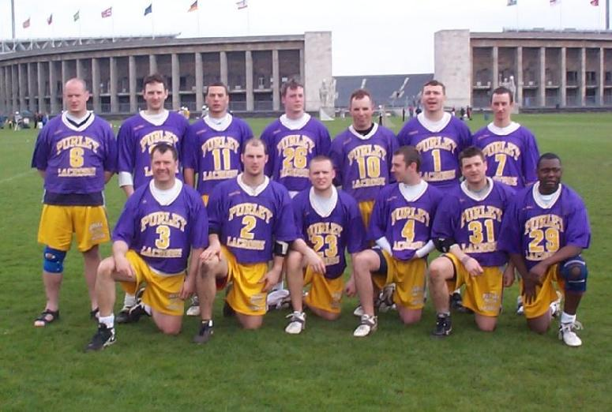

import Gallery from '~/components/Gallery.astro';

\
*Top:* Dave Arnot, Dave Slaughter, Denham Pope, Chris Spence, Darren
Novell, Paul Terry, Matt Payne \
*Bottom:* Andy Booth, Mike Barrett, Greame Holland, Dean Searle, Tim
Richmond, Mike Husey

## Day One

### Purley 11 - Vfk Berlin 3

We took some time to get going but ran out easy winners. Matt Payne had a
great game, he dominated the midfield and top scored with five.

Scorers: Matt Payne 5, Tim Richmond 3 and Darren Novell 3.

### Purley 14 - German All Stars 2

This was a far better game. The German All Stars turned out to be the
majority of the German squad that will play in this years European
Championships, but we moved the ball well and the tricks were beginning to
come out the bag. Mike Barrett followed Matt's example from the first game
and had a big game. Dave Arnot also opened his account for the tour and
quickly followed it with a few more goals.

Scorers: Dave Arnot 4, Tim Richmond 4, Matt Payne 2, Mike Barrett 2 and The
Mystery Man 2.

## Day Two

### Purley 5 - Radotin 3

This was a scrappy game with the Czech's hitting hard. As a team we made
too many errors but the defence held firm as we battled our way to another
win. A major down side of this game was the fact that Dave Arnot damaged
his knee ligaments and so would not play again on this tour.

Scorers: Mike Barrett 2, Dave Arnot 2 and Tim Richmond 1.

### Purley 10 - LC Munchen 2

Following Daves injury Graeme Holland stepped into attack and opened the
scoring with his first touch of the game! Once again our midfield dominated
the opposition and scored a few as well.

Scorers: Graeme Holland 3, Tim Richmond 2, Matt Payne 2, Chris Spence 1,
Mike Barrett 1 and Darren Novell 1.

## Day Three

### Semi Finals : Purley 6 - Budweiser Rebels 11

This was a great game to play in. Team Budweiser were a very talented bunch
of individuals and it was a very good spirited game. Paul Terry had a great
game in goal and pulled off a few saves he had no right to make.
Unfortunately this wasn't enough to stop the yanks, so sadly our defence of
the Berlin Open ended here and we were denied the opportunity to play
Cheadle. Oh yeah, and I must also mention Tim Richmond's 'Air Gait'. Good
job Thunder!

Scorers: Tim Richmond 3, Mike Barrett 2 and Darren Novell 1.

### Semi Final 2 : Cheadle 19 - Sundbyberg 1

### Third Place Play-off : Purley 10 - Sundbyberg 1

This was our last game of the tour and it was time to have a bit of fun!
Andy Booth got on the score sheet with his usual finish tucking one nicely
in to the bottom left corner! Chris Spence also got a rather nice one and
was also able to show off his great fake. Tim came up with another 3 to end
the tournament as our top scorer on 16 goals. So the Berlin Open was over
for another year, here's hoping we make it to Mardi Gras in New Orleans
next year.

Scorers: Tim Richmond 3, Graeme Holland 2, Darren Novell 2, Chris Spence 1,
Mike Barrett 1 and Andy Booth 1.

### Final : Cheadle 13 - Team Budweiser 8

For the first quarter this looked like it could be a very close game.
Cheadle opened the scoring with 2 goals, which Bud quickly equalled to
their great delight. However after that Cheadle put on the pressure and
started to build a commanding lead. Bud rallied in the third quarter, and
managed to pull back to within a couple of goals, but Cheadle seemed to
have an extra gear whenever the game got too close. The fourth quarter saw
Cheadle controlling the game, as after a long weekend and with only 12
players in their squad Bud started to tire.

So, well done to Cheadle. We'll see you in the Iroquois Cup and Wilkinson
Sword.

## Tournament Goal Totals

Tim Richmond 16 \
Darren Novell 11 \
Matt Payne 9 \
Mike Barrett 8 \
Dave Arnot 6 \
Graeme Holland 5 \
Chris Spence 2 \
Mystery Man 2 \
Andy Booth 1

Goals for 60, against 23 in 6 games.

## Pictures

<Gallery />

## And finally

Many thanks to our hosts at Berlin Lacrosse, to the referees, and to all
the other teams from Germany, Sweden, the Czech Republic, USA, and good old
Blighty, who made the tournament what it was.

And don't forget to check out what happened [last year](/1990s/berlin99).
