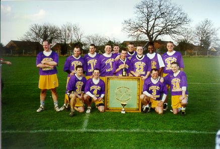

import Gallery from '~/components/Gallery.astro';

\
Back: Dave Arnot, Darren Novell, Denham Pope, Paul Terry, Chris Spence,
Matt Payne, Scott Nicholls, Graeme Holland, Mike Husey, Kevin Barnicle \
Front: Tim Richmond, Dean Searle, Andy Booth, Dave Slaughter \
[Pictures](#pictures)

## Purley vs Kenton

This was the best game so far. Kenton put out the strongest side that
Purley have played against all year. Purley decided to do something a
little different from the start and played 2 long stick wing men on nearly
every face. This meant that Purley got possession from almost every
face-off.

The first quarter was pretty close but Purley ended it 5 - 2 ahead. The
Purley attack had started well with Tim Richmond, Dave Arnot and Darren
Novell all scoring in the first quarter. Tim also gave Kenton's England
keeper Simon Savage a sign of what he could expect for the whole game by
shooting from distance and nearly burning a whole in the top right corner
(a beautiful goal!).

The second quarter was much closer with Kenton creating many more chances
than Purley. But Purley's defence was playing well and the quarter ended
7 - 6. The third quarter was when the game really came to life. Purley
scored a couple of well crafted man up goals and Tim scored another
laser-like crank to the same corner, quickly followed by Dave Arnot showing
that anything Timmy can do he can as well by blasting one into the same
corner! Purley's defence also stepped up a gear and with the "Denham and
Dean show" limiting Kenton to a handful of chances which were all soaked up
by goalkeeper Paul Terry. The quarter ended 13 - 6.

The fourth quarter seemed to fly by. Kenton scored first but this proved to
be their last goal and long stick Andy 'Papa' Booth wrapped things up with
Purley's final goal. The game finished 14 - 7. To be honest everyone had a
good game and the whole team deserves a mention (goals in brackets):

Goal keeper: Paul Terry\
Long Sticks: Denham Pope, Dean Searle, Dave Slaughter, Andy Booth (1),
Kevin Barnicle, and Scott Nicholls\
Middies: Mike Barrett, Matt Payne, Graeme Holland (2), Chris Spence, and
Mike Husey (1).\
Attack: Tim Richmond (5), Dave Arnot (3), and Darren Novell (2).

## Pictures

Thanks to Trevor Rogers of the Reading Wildcats for the action shots of the
game.

<Gallery />
