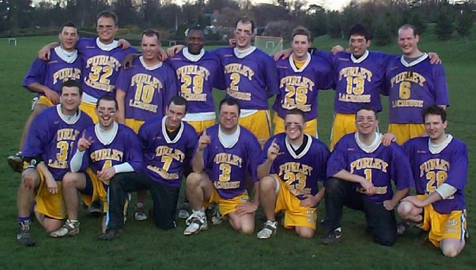

\
*Back:* Denham Pope, Kevin Barnicle, Darren Novell, Mike Husey, Mike
Barrett, Chris Spence, Steve Kenward, Dave Arnot\
*Front:* Tim Richmond, Dean Searle, Matt Payne, Andy Booth, Graeme Holland,
Paul Terry, Dave Slaughter

## Division 1

| P | W | D | L | F | A | GD | Pts |
| - | - | - | - | - | - | -- | --- |
| 15 | 15 | 0 | 0 | 215 | 45 | 170 | 30 |

Check out the [match reports](reports), or the [results](results).

## Senior Flags

**Final:** Purley 14 - Kenton 7

Check out the [report and pictures](flags).
