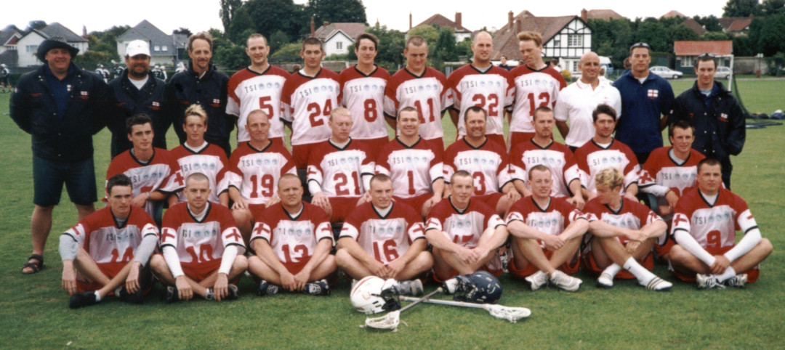

## European Championships 2001

*July 15th to the 21st*

This is the story of how seven Purley players represented England at the 2001 European Championships in Penarth, Cardiff, Wales (it actually should have been eight, as Matt Payne was picked for the squad, but was injured in a warm-up game and didn't recover in time). The series of events is written from memory over 20 years after the events, and I'm not sure I had an accurate picture at the time, so please forgive any mistakes. The substance should be pretty much correct though.

\
Team England (Purley players in bold)\
Top: Dave Hallows, Peter Compton, Steve Cluney, **5 Dave Slaughter**, 24 Jeff Kettlewell, 8 Tom Seneviratne, 11 John Beadle, **22 Mike Barrett**, **12 Scott Nicholls**, Justin Camarda, **Denham Pope**, **Matt Payne**\
Middle: 7 Matt Beadle, 2 Alan Keeley, 19 Steve Green, 21 Paul Flowers, **1 Paul Terry**, **3 Andy Booth**, **4 Dean Searle**, 6 Andy Morris, 20 Will Kent\
Front: 14 Anthony Edwards, 10 Chris Wells, **13 Graeme Holland**, 16 Ryan Pettit, 17 Neil Trennell, 18 Steve Shanahan, 15 Daniel Kallaugher, 9 Patrick Gowan

The England camp, somewhat controversially given that they were the current European Champions, decided to concentrate on development for the 2002 World Championships in Australia, and skip the 2001 European Championships. A charitable interpretation might consider the time commitments and costs involved, but still, not the best look for England.

This did not sit at all well with [Peter Mundy](https://www.southlacrosse.org.uk/2025/01/in-memory-of-peter-mundy-1929-2025), President and founder of the European Lacrosse Federation, and in his usual inimitable style he set out to do something about it. The current England team was exclusively North of England based, so he decided to gather an England side from the South, and his first port of call was the current SEMLA League and Flags champions Purley.

Peter was a frequent guest at Purley's end of season dinners (he did after all play there at the start of his career before moving to Croydon), and when he attended this year he asked for a minute to address the room. What followed was an impassioned speech in which he laid out why England had to send a team to the European Championships, and his vision of Purley forming the spine of that England team.

It didn't take much to persuade the core of the Purley team, and the project was off and running.

I'm not sure if Peter had already enticed Trevor Rogers to be team manager, or if that came later, but Trevor got busy organising everything that was needed behind the scenes. Open trials were arranged over a weekend at Reading, and several Northern players attended and made it into the final squad.

I won't go into the events of the week spent in Wales here, except to say that England finished runners-up, comprehensively beaten by Germany in the final. For a full write-up see [the article in Lacrosse Talk by Jeff Kettlewell](https://drive.google.com/file/d/1jjHXAqM93NNw9Y1Wlk354VKDJUH5K7Ox/view?usp=drive_link) (see page 14, with more coverage from a Welsh angle on the following pages) - or see [a text only version with no pictures](european-championships-report) (but much easier to read!), or a [high res version](https://drive.google.com/file/d/16W37mmsCYiYxN9WSRStmhXfEO61t2nnK/view?usp=drive_link).

However, there are couple stand-out memories that are worth noting here:

### Opening Ceremony

Early Saturday evening all the teams had to dress in their team apparel (in our case we had custom white polo shirts with the England flag and red trim, and khaki trousers), and meet at a sports ground in a park not too far from our accommodation, along with the referees and some of the organisers.

Each team was given their nation's flag, and told to form into ranks of three. We obviously chose Purley player Scott Nicholls to carry the flag, given he's Australian (he qualified for England through grandparents I believe), and off we went.

We soon met up with Mr P's New Orleans style jazz band, who had been organised to lead the teams. We walked through the park, the jazz blaring (think "Live and Let Die" with the funeral procession in New Orleans), passing a few startled people walking their dogs, and to be frank we were all starting to feel a little bit silly.

Then we got to the exit of the park, and onto the main road into Cardiff. Now, what we didn't know, or perhaps weren't aware of, is that one of the organisers was very high up in the Cardiff constabulary, and had arranged for the roads to be closed off for us to march the just over half a mile to City Hall, and for two police horses to lead the way.

So, the jazz band fell in behind the horses, and we started walking down the middle of the main road into Cardiff. It really was surreal, and even more so as we passed the entrance to Cardiff Castle where there were huge crowds of people on the pavements who loudly cheered or booed the teams, some people even leaning out of hotel windows to shout.

Sadly they weren't there for us, but had gathered for the Robbie Williams concert that was due to start shortly in the Millennium Stadium. But still, you can dream - and it did make it a walk to remember.

We eventually made it to City Hall for the opening ceremony, but after the previous excitement the speeches were rather forgettable!

It also turns out that our Welsh hosts went all out on the pomp and ceremony, with the First Minister of Wales, Rhodri Morgan, presenting the trophy and medals after the final.

### The Team Physio

Before this tournament I don't think any of us appreciated how essential the services of a team physio/sports masseur are for a week-long tournament.

With most of the team not being used to having the services of a physio, the first evening the queue for a sports massage at team physio Steve Cluney's door was only made up of most of the Purley players, and we'd mainly gone to show support for him being there as we knew him from back at our club (he'd worked with Mike Barrett).

We'd had training sessions that morning and afternoon, and the hard ground meant many of us had tight calves, along with other assorted strains. When we left his massage table the difference was remarkable, the tension was gone, and full flexibility had returned. Any of us who had doubts were now thoroughly sold on the treatment, even with the excruciating pain some of Steve's techniques caused!

This was also noticed by the rest of the team, and the next evening Steve had at least double the number of clients, and by Monday all 23 players were lined outside his door. A trend that continued for the rest of the tournament.

The way he kept the physical condition of the team at the best possible level was invaluable to us, and we all chipped in to get him an engraved tankard as a small token of our appreciation.

## Full Roster

See the [full event programme](https://drive.google.com/file/d/1-26_QIeD81WnMGfnJzj7CtBDNpovt5QM/view?usp=drive_link) for more details.

### Goal

Paul Terry - **Purley**\
Chris Wells - Poynton

### Defence

Andy Booth - **Purley**\
Andy Morris - Croydon\
Dean Searle - **Purley**\
Dave Slaughter - **Purley**\
Patrick Gowan - Commonwealth LC Cal\
Alan Keeley - Spencer

### Midfield

Mike Barrett - **Purley**\
Tom Seneviratne - Sheffield University\
Graeme Holland - **Purley**\
Daniel Kallaugher - McDonogh School (USA)\
John Beadle - Cheadle Hulme\
Matt Beadle - Cheadle Hulme\
Scott Nicholls - **Purley**\
Will Kent - Hulmeians\
Steve Shanahan - Cheadle\
Paul Flowers - Cheadle

### Attack

Steve Green - Oldham\
Anthony Edwards - Hulmeians\
Neil Trennell - Stockport\
Ryan Pettit - Sacred Heart University\
Jeff Kettlewell - Hulmeians

### Manager

Trevor Rogers - Reading Wildcats

### Head Coaches

Dave Hallows - Hampstead\
Peter Compton - Spencer\
Tom Warnes - Hulmeians

### Assistant Coaches

Justin Camarda - Hitchin\
Denham Pope - **Purley**\
Matt Payne - **Purley**\
Viscount Bailey - Fitness\
Steve Cluney - Physio
