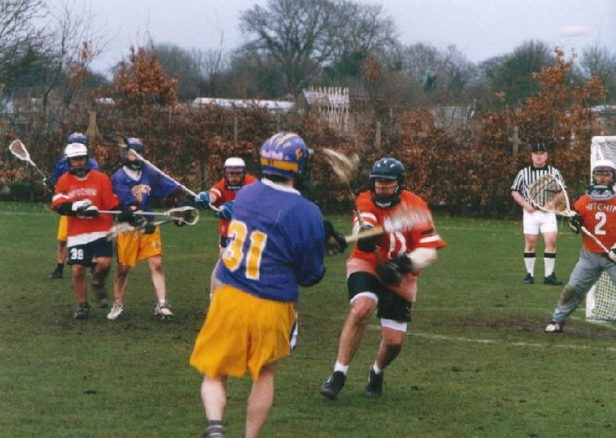

import Gallery from '~/components/Gallery.astro';
import { YouTube } from '@astro-community/astro-embed-youtube';

## Purley vs Hitchin - Reading, 24th March 2001

<YouTube id="JnGV9gErvlw" class="four-by-three" />

With heavy rain again dominating the weather during the week, it wasn't
looking good for a fast flowing game of lacrosse. The omens weren't looking
good either, as every single Purley player got lost trying to find the
ground (come on Reading, get your directions sorted). However, once the
team arrived they found the pitch in superb condition - except right in one
corner, which was ankle deep in water.

With the other flags games over running, the start of the Senior Flags
Final was delayed for quite a while. When the match finally started, Purley
were ready. They dominated the early possession, and created several good
scoring opportunities, but for the first few minutes they couldn't find the
net, and the Purley supporters must have been concerned that it was going
to be one of those days. However, they needn't have worried. Jamie Tasko
moved onto the crease right in front of goal. Dave Arnot spotted that
Jamie's marker wasn't paying as much attention as he should have been, and
fed the ball right into Jamie's stick. Unfortunately, Jamie was so surprised
at being fed the ball he immediately dropped it, but recovered quickly to
pick up the ball and slot it home. One - nil to Purley. This was followed
pretty quickly by a well worked man-up play - good movement off the ball
pulled all the Hitchin defence right onto their goal, Matt Payne moved into
the open space in front of goal, received the ball from Tim Richmond, and
slotted it home. Purley continued their domination of the first quarter and
scored three more goals - taking the quarter time score to 5-0.

In the second quarter Hitchin rallied, and managed to gain more possession
than they had in the first quarter. However, they found it difficult to
breach the Purley defence - though they did notch up one goal. At the other
end, the Purley man-up attack was still working well, with Tim Richmond
pinging one in off the crossbar. The Purple and Gold were finding it more
difficult to score from open play due to a combination of several good
saves by the Hitchin keeper, and poor shooting by Purley. At half time it
was 7-1 to Purley.

\
Tim Richmond fires a shot

The third quarter saw what was probably the goal of the game - Scott
Nicholls intercepted the ball, passed to Dave Arnot, who hit Tim Richmond
with a beautiful cross field pass, and Timmy fired the ball into the top of
the Hitchin net. The ball went from one end of the pitch to the back of the
Hitchin goal in only a few seconds. There was one other moment of note in
the quarter (and he'll crucify me if I don't mention this). Purley keeper
Paul Terry picked up the ball behind his own net, and the team set up it's
usual clear. As Paul ran up the field with the ball, the centre of the
pitch seemed to open up before him, so he just kept on going. By the time
the Hitchin defence decided that he was a threat he was already on their
restraining line. He shot...he scored, much to the delight of his team
mates. Nice one, Paulie. At three quarter time it was 11-1.

The last quarter saw another goal from Hitchin - a rocket from just inside
the restraining line. However, Purley were in control and scored five
more - including a very nice round the back shot from Jamie Tasko. Final
score 16-2.

If you just read the score-line you may think this was a one sided game.
However Hitchin played hard, and made it a great spectacle of lacrosse.
Their efforts are best summed up by SEMLA President James Kellam, who in
his presentation after the game said *"Hicthin made a game of that. The
score doesn't reflect the commitment and
dedication that there was. There was a never say die attitude which I
greatly admire in Hitchin"*. I couldn't have put it better myself.

As in [last years Flags final](/2000/flags) everyone had a good game, and
the whole team deserves a mention:

Goal keeper: Paul Terry (1G) \
Long Sticks: Andy Booth, Denham Pope, Dean Searle and Dave Slaughter \
Middies: Mike Barrett (1G, 1A), Graeme Holland (3G), Mike Husey, Scott Nicholls (1G), Matt
Payne (1G, 2A), and Greg Venville \
Attack: Dave Arnot (6A), Tim Richmond (4G, 2A), and Jamie Tasko (3G)

(2 goals unaccounted for)

We'd like to thank the Reading Wildcats for hosting the event (it's a great
venue for lacrosse, once you can find it), and of course to the refs,
without whom no game is as enjoyable.

And finally, well done to the Walcountian Blues (formerly Chipstead &
Tatsfield) for winning the Minor Flags - by one goal I hear. Their
opponents in the final, the Reading Wildcats, had beaten them twice in the
league this year, so it was a great achievement.

## Pictures

<Gallery />
