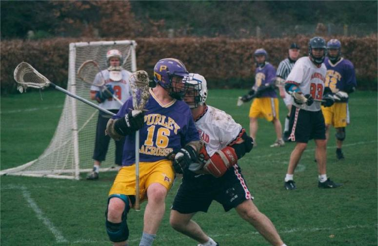
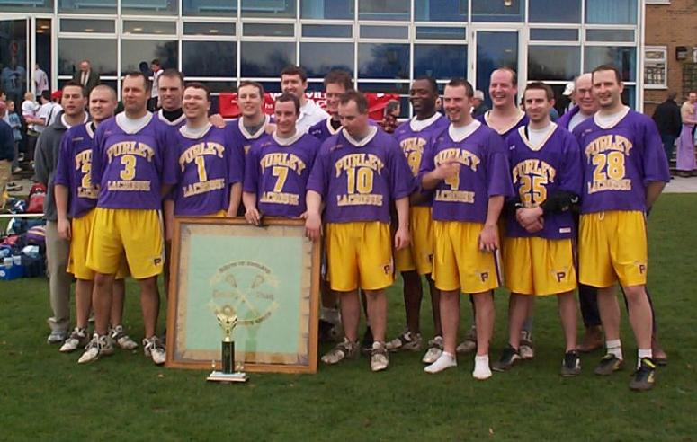

import Gallery from '~/components/Gallery.astro';
import { YouTube } from '@astro-community/astro-embed-youtube';

## Purley vs Hampstead - Reading, 23th March 2002

<YouTube id="1t7kyLxZYvE" class="four-by-three" />

The day both teams had been waiting for had finally come - Hampstead versus
Purley in the Senior Flags Final. Hampstead were out to prove they had the
strength to beat Purley, and Purley had a three year undefeated run to
continue and the opportunity to win the Senior Flags title for the third
year running.

The start was pretty frantic with neither team wanted to give an inch.
Neither side settled quickly, and it was ten tense minutes before Darren
Novell scored the first goal for Purley. Hampstead replied quickly, and
added two more goals to win first quarter 1-3. From that point on goals
were exchanged - Hampstead always leading, but Purley stayed in touch and
never let them out of reach. The second quarter ended 3-4 to Hampstead,
with Purley having hit the post five times. The third quarter ended 5-7,
and it was now time to get serious!

Ground balls were now everything, and Purley Captain Scott Nicholls and
Matt Payne dominated their opponents. The Purley game plan was to win three
face-offs, hold the ball, kill the clock, and score three goals. Eight
seconds of the final quarter saw Purley get the first of their goals, as
Scott Nicholls won the ground-ball from the face-off and fed Graeme Holland
who slotted home. A minute later Jamie Tasko tied the scores, and barely 30
seconds after that Darren Novell fed Dave Arnot to give Purley the lead.
Within three minutes the three faces had been won, the three goals scored,
but there was still 17 minutes on the clock! Purley were now leading for
the first time in the match since the first goal, and it was a tense 10
minutes before they increased their lead to 9-7. With 3 minutes remaining
Hampstead then pulled one back on a man up, to set up a tense finish. But
Purley were dominating face-offs now and got the ball back straight away.

\
Dave Arnot getting friendly with the Hampstead defence

So three minutes to go.... Purley leading by one and in possession of the
ball. Hampstead piled on the pressure and with a stalling warning Purley
had to keep it inside the restraining line. Graeme Holland gets suck in a
corner but protects the ball brilliantly, takes on four Hampstead players
(out of necessity not choice!) and then feeds Matt Payne on the crease for
a simple one-on-one goal. Purley up by two again, and this goal looks to
have killed Hampstead. In the dying moment of the game Purley added two
more goals as Hampstead tried to maintain the pressure, but to no avail.
Final score: 12 - 8.

Scott Nicholls gave a truly "awesome" Captain's speech when accepting the
trophy from SEMLA President John Maynard - he could have been accepting an
Oscar the way he went on - I think he broke the record for the most uses of
the word "awesome" within a 2 minute speech - awesome!!

A special thanks to Reading for great hospitality again this year, and of
course to the Refs.

## Team Purley

Goal: Paul Terry\
Defence: Andy Booth, Dean Searle, and Dave Slaughter\
Midfield: Ben Clueit, Stuart Green, Mike Husey, Scott Nicholls (2G, 1A),
Matt Payne (3G, 1A), Chris Spence, and Jamie Tasko (2G)\
Attack: Dave Arnot (3G, 1A), Graeme Holland (1G, 2A), and Darren Novell (1G,
2A)

\
Back Row: Denham Pope, Graeme Holland, Scott Nicholls, Chris Spence, Stuart Green, Jamie Tasko, Mike Husey, Dave Arnot, Tony Bennett\
Front Row: Andy Booth, Paul Terry, Matt Payne, Darren Novell, Dean Searle, Ben Clueit, Dave Slaughter

## Pictures

Thanks to Peter Rawsthorne from the Reading Wildcats for the action shots
of the game.

<Gallery />
