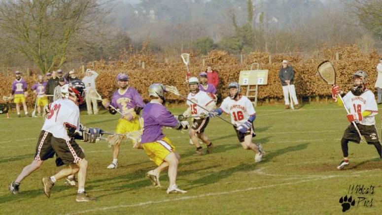

import Gallery from '~/components/Gallery.astro';
import { YouTube } from '@astro-community/astro-embed-youtube';

## Purley vs Hampstead - Reading, 22nd February 2003

<YouTube id="ANu0sZyX96Q" class="four-by-three" />

This match between the two powerhouses of Southern lacrosse promised to be
one to remember. Only a month ago Hampstead had brought Purley's four year
unbeaten League record to an end with a thrilling 13-12 win at Old Deer
Park, and the Purley boys were undoubtedly out to avenge that defeat.
Hampstead, buoyed by that victory, were seeking to erase the memory of last
years final against Purley, when they went into the final quarter with a
two goal lead, only to be beaten 12-8.

In the first half Purley had long periods of possession, and though they
moved the ball well round the perimeter, they failed to make many good
scoring opportunities, and when they did the shooting was poor. Hampstead,
on the other hand, were more clinical, and though Purley out shot Hampstead
by 18 to 10, they went in at half time 2 all - a rather surprisingly low
score line for these two usually free scoring sides.

In the third quarter Hampstead made Purley rue those missed chances, and
gave a master class on how to finish. With six goals from only nine shots,
Hampstead kept pulling away to what seemed to be an unassailable lead.
Purley just couldn't seem to figure out a way to stop the rot. At the other
end things weren't much better, and though Purley had several chances, the
only goal came from a fine solo effort by Mark Dingfield.

So, at three quarter time is was 3-8 to Hampstead. All they had to do was
hold their nerve for the final 20 minutes, and the Flags were theirs.
Purley had come back from a two-goal deficit in last years final, and in
the process won the fourth quarter 7-1 - surely it couldn't happen again,
surely a five-goal lead was too big even for Purley!

And then began what could go down as the finest comeback in Flags history.
Purley were starting the fourth quarter with a man advantage, as one of the
Hampstead players served what remained of a minute and a half in the sin
bin, and they knew they had to capitalise on this if they were to have any
chance. Purley moved the ball round, trying to create the opening. The
first shot went wide, but then Matt Payne fired a rocket into the top right
hand corner of the goal. With still half a minute remaining on the penalty,
Purley won the next face-off, and Mike Barrett fed Graeme Holland, who
faked the keeper, and slotted the ball home. With less than two minutes
gone, Purley had the deficit back to a more manageable 3 goals.

\
Mark Dingfield drives on goal

In the next few minutes Purley dominated possession, and Mark Dingfield
dodged his opponent and slotted the ball home. The Referees said the ball
had never crossed the line, but our video replay showed it had bounced out
from the pipe at the back of the goal. Despite this setback, Purley were
now showing why they have dominated Southern lacrosse for the last four
years. The constant pressure on the Hampstead goal led to more penalties,
and Purley used this to their advantage as Mark Dingfield pulled the score
back to 6-8. A minute later Ryan Lynch brought Purley back to only one
behind, and with still eight minutes remaining another man-up saw Darren
Novell feed Mike Barrett who fired low to bring the scores level.

With their lead having disappeared, and everything still to play for,
Hampstead called a time-out in an attempt to re-gather themselves, and
throw Purley off their stride. It didn't work. A couple of minutes later
Sam Bugeja fired the ball in just under the cross bar, and Purley were
ahead. It was looking like it would be a very tense finish, until three
minutes later Mike Barrett scored what turned out to be the last goal of
the game, bringing the final score to 10-8 to Purley. To underline Purley's
dominance of the quarter, Hampstead had their only shot with under a minute
to go, and by then game was probably beyond their reach.

In football the saying is "it's a game to two halves", but this final could
be said to be "a game of two quarters". From the sideline Purley looked to
be two different sides in the third & fourth quarters. Many teams would
have folded after a third quarter like that, but the Purley team spirit,
and belief in themselves saw them through - and it was probably teamwork
that was the difference between these two sides on the day. It was a fine
effort by the entire Purley team, but especially Mike Barrett, who was
named man of the match by the Referees for his 3 goals and one assist.

A special thanks to Reading for great hospitality, and of course to the
Refs.

## Team Purley

Goal: Paul Terry\
Defence: Andy Booth, Dean Searle, Dave Slaughter and Ted Whitehouse\
Midfield: Mike Barrett (3 goals, 1 assist), Sam Bugeja (1 goal, 1 assist),
Stuart Green, Mike Husey, Ryan Lynch (1 goal) and Matt Payne (1 goal)\
Attack: Mark Dingfield (2 goals, 2 assists), Graeme Holland (2 goals) and
Darren Novell (2 assists)

## Pictures

Thanks to Peter Rawsthorne from the Reading Wildcats for the action shots
of the game.

<Gallery />
