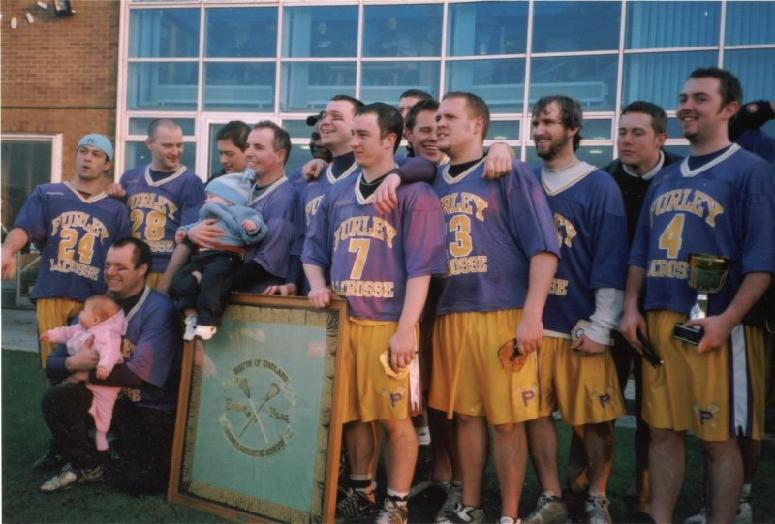

\
Sam Bugeja, Andy Booth (kneeling), Dave Slaughter,
Jamie Tasko, Darren Novell, Mike Husey, Paul Terry, Matt Payne, Stuart
Green, Mark Dingfield, Graeme Holland, Ryan Lynch, Chris Spence, Dean
Searle

## Division 1

| P | W | D | L | F | A | GD | Pts |
| - | - | - | - | - | - | -- | --- |
| 16 | 15 | 0 | 1 | 296 | 44 | 252 | 46 |

Check out the [results and match reports](results).

## Senior Flags

**Final:** Purley 10 - Hampstead 8

Check out the [video, report & pictures](2003flags).
