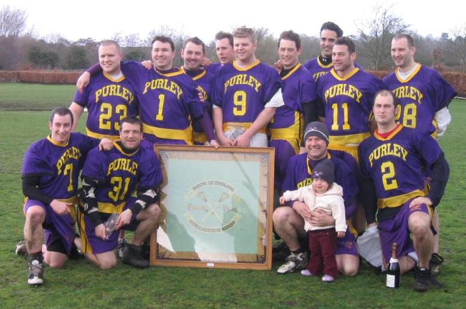

import { YouTube } from '@astro-community/astro-embed-youtube';

## Purley vs Hillcroft - Reading, 20th March 2004

<YouTube id="4P6N6WUzIB0" class="four-by-three" />

It was a wet, cold and windy at Reading for the Senior Flags final, which
was doubly bad news for the players. Not only was it unpleasant to play in,
but also the customary finals atmosphere was missing as the weather kept
the normally large crowd away, and only the die-hard fans braved the
sidelines.

Purley's opponents Hillcroft have had a resurgence this season, and showed
they could tangle with the big boys in a nail biting 12-11 win over
Hampstead in the semi-final, and a narrow 5-7 defeat to Purley in their
previous encounter. But Purley were looking for their fifth Flags title in
a row, so if Hillcroft wanted to lift the trophy they'd have to pull out
all the stops.

It was a nervy first couple of minutes, with possession evenly shared.
Hillcroft didn't help themselves, turning over the ball too often as they
tried to force the play. On the other hand, Purley were more deliberate,
but they failed to make the final shot tell until 5 minutes in when Tim
Richmond drove on goal and put a bullet in the top right hand corner. From
the ensuing face-off Purley gained possession in their defensive end, moved
the ball down the sideline, round the back of goal to Tim Richmond, who fed
Chris Spence cutting towards goal, and Chris slotted home for 2-0. As the
quarter continued Purley began to dominate the possession, and three more
goals from Tim Richmond, and one for Mike Barrett took the quarter time
score to 6-0 to Purley.

Hillcroft really needed to reduce that deficit early in the next quarter,
but it was Purley who increased their lead, first through a strong drive on
goal by Tim Richmond, then Dave McCulloch fed Jamie Tasko for a trademark
crease goal under pressure. Hillcroft then managed to get their name on the
score sheet, with a goal against an uncharacteristically disorganised
Purley man-down defence, and rapidly got another with a tight-angled shot.
Having steadied the ship, Hillcroft then let themselves down with some
undisciplined play as first one, then another player were sin-binned for a
minute - and with a 6-on-4 offence it was only a matter of time for Purley
to find an opening, and Tim Richmond added to his growing tally. Hillcroft
replied quickly with a well-taken individual goal - a dodge from level with
the goal, and dive and shot just outside the crease. But again they gave
Purley an easy goal, this time when their midfield were slow to react to
losing the ball over the sideline. The Purley defence weren't however, as
Dave Slaughter quickly took the ball, found Andy Booth charging down the
middle of the field to make a 4-on-3 break, and the Purley attack
clinically moved the ball round to find an open Jamie Tasko, who slotted
the ball round the keeper. The final goal of the quarter came when Dave
McCulloch slipped through two defenders, drew another three, and managed to
get the shot in. The keeper saved, but couldn't hold onto the ball. With no
Hillcroft defence left to cover, Jamie Tasko was free to scoop up the loose
ball to score. Shame that doesn't count as an assist for Dave - but that's
the way stats go.

Given that the Purley defence have given up a maximum of 7 goals in League
and Flags matches this season, the half-time score of 11-3 meant the
contest was effectively over. However Hillcroft never gave up, and managed
to make it a more even second half. In the next quarter all the goals came
in the first five minutes - Purley got two in transition play, and
Hillcroft replied with one. Hillcroft scored first in the final quarter,
and then Purley keeper Paul Terry decided to go on a run up field with the
ball. As he got to the Hillcroft end he drew 2 defenders, and not
unexpectedly got nailed. However he did manage to get the pass off first,
and with the cover drawn the Purley attack are masters at finding the open
man, on this occasion it was Matt Payne, who buried the ball in the net.
Two more goals for Purley took the final score to 16-5.

As always, it was a good all-round team performance from Purley, but
special mention must go to "The Thunder from Down Under", Tim Richmond, who
was on fire with his 7 goals and 1 assist.

Our thanks go to the Refs (Simon Peach, Jon Harrop and Rob Collinge), to
Reading LC for hosting the finals, to anyone who braved the sidelines on
such an awful day, and especial thanks to Nicki Holland for shooting the
video.

\
*Back:* Graeme Holland, Paul Terry, Dean Searle, Chris Spence, Dave
McCulloch, Jamie Tasko, Ted Whitehouse, Denham Pope, Dave Slaughter \
*Front* Matt Payne, Tim Richmond, Andy Booth (with Milla), Mike Barrett

## Team Purley

Goal: Paul Terry\
Defence: Andy Booth, Dave Slaughter and Ted Whitehouse\
Long-stick midfield: Denham Pope and Dean Searle\
Midfield: Mike Barrett (2 goals, 1 assist), Graeme Holland (1 assist), Matt
Payne (2 goals, 1 assist) and Chris Spence (1 goal, 1 assist)\
Attack: Dave McCulloch (2 assists), Tim Richmond (7 goals, 1 assist) and
Jamie Tasko (4 goals, 2 assists)
