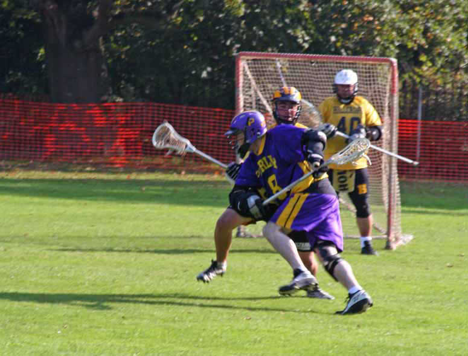

import Gallery from '~/components/Gallery.astro';

\
Nigel Tasko goes for goal

Purley took on Hillcroft in their first home game since their return to
Sandilands. The pitch was in pristine condition, the sun was shining - what
better to do than play lacrosse?

Hillcroft started brightest, taking the lead early, but two solo goals by
Nigel Tasko say Purley edge in front - and it continued nip and tuck all
the way. Purley failed to take advantage of their superior possession, and
Hillcroft were more decisive, especially their left handed attack man.
Purley did manage to pull into a 2 goal lead mid way through the second
quarter, through a goal by keeper Paul Terry - loverly. Paul crossed the
half way line on the clear, and since the field was open in front of him
drove towards the goal. Steve Flint in the Hillcroft net knew the shot was
coming, but a vicious shot low between the legs left him looking rather
less than pleased. This rallied the Purley side, and they dominated
possession for the next few minutes. It looked like they would pull away to
a decisive lead, but stern defence by Hillcroft kept Purley out, and
Hillcroft managed to pull the score back on a fast break to bring the
score to 6-5 at half time.

The third quarter was much of the same, with the lead changing hands
several times, ending with the scores tied 9-9 to set up a tense finish. In
tight battles like this it is often the first goal in the final quarter
which is crucial - and it was Hillcroft who scored it, and more. Purley
simply squandered too much of their possession, and Hillcroft pressed their
advantage to go 3 goals up. If Hillcroft thought it would be any easy ride
to the final whistle, they were much mistaken, as Purley pressed and pulled
one back, then two - but unfortunately for the Purple and Gold time had run
out, and Hillcroft ran out winners 13-12.

Scorers: Dave Arnot 4, Nigel Tasko 3, Tim Richmond 2, Paul Terry 1, Matt
Payne 1, Mike Barrett 1

<Gallery />

Photos by John Maynard.

