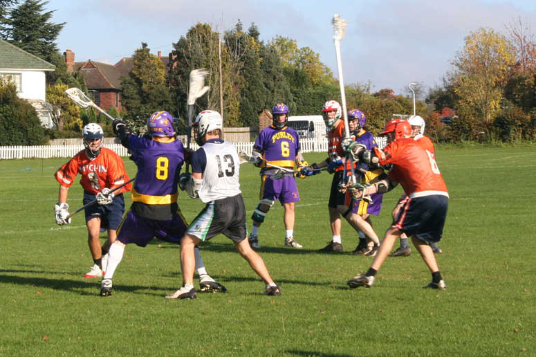

import Gallery from '~/components/Gallery.astro';

\
Nigel Tasko tries to get the shot away

Purley's return to Sandilands has not got off to the best of starts, and
things went from bad to worse when they faced Hitchin at the weekend.

Purley won the first face-off and dominated possession at the beginning of
the first quarter. However, Hitchin's defence was well organised, and
though Purley created several shooting chances, none of them were clear
cut. Hitchin eventually broke the deadlock with a well taken opportunity on
their first shot of the game, and they continued to be clinical during the
first quarter with 3 goals from 3 shots.

Purley were extremely ill disciplined during the first half taking about 8
penalties for silly fouls. Unfortunately for Purley, Hitchin's man up unit
were working well and they converted from at least 4 of these
opportunities, and Hitchin went into the break 7-3 up.

In the second half Purley started to cut out the silly mistakes, and began
to claw their way back into the game. Well taken goals from Mike Barrett,
Matt Payne and Tim Richmond seemed to settle the team. The defence started
to communicate with each other and there was much more movement off the
ball in attack. However Hitchin were keen to play the clock, and whenever
they had possession they tried to eat up as much time as possible by
holding the ball in a corner behind the Purley goal. A lack of urgency by
Purley to get the ball back in the third quarter probably cost them the
game, as their comeback eventually ran out of time with the game finishing
8-10.

Hitchin played good controlled Lacrosse and were the better team. It's just
a shame that Purley didn't start with the urgency that they finished the
game with as this would have been a thrilling encounter.

Goals: Dave Arnot 2, Mike Barrett 2, Matt Payne 2, Tim Richmond 1, Nigel
Tasko 1

<Gallery />

Photos by Steve Cluney and Jamie Tasko.

