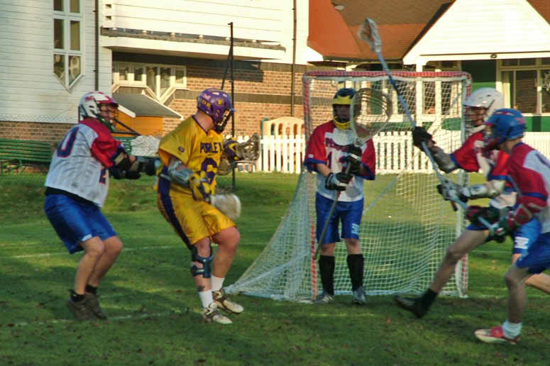

import Gallery from '~/components/Gallery.astro';

\
Dave Arnot tries the underhand shot

After last weeks dour performance it was time for Purley to show a little
more class, and that is exactly what they did against a visiting Penarth.

The first quarter started like it was a personal competition between the
Tasko brothers, with Nigel and Jamie matching goals to rapidly take the
Purple and Gold to a 2-0 lead. Dave Arnot used his twinkle toes to ghost
past four Penarth players untouched before finding the back of the net, and
with a quarter time score of 7-0 the game was effectively over as a
contest.

After a foul at the end of the first quarter Penarth started the second
with possession and quickly got their name on the score sheet on the
man-up, but after that it was more of the same for Purley. Good team work
and movement in attack along with slick ball movement led to some
attractive goals, the majority being assisted, and they stretched the lead
to 12-1 at the half and 16-2 at three quarters.

In the final quarter lack of concentration in the Purley defence gifted
Penarth a couple of goals, but Penarth battled well tying the quarter at
one point 3-3, before Purley accelerated again to take the quarter 7-4, and
the game 23-6. Over all a good day at the office for Purley.

Goals: Jamie Tasko 8, Dave Arnot 7, Matt Payne 3, Nigel Tasko 2, Jesse
O'Hanley 1, Dave Cluney 1, Graeme Holland 1

<Gallery />

Photos by Steve Cluney.

