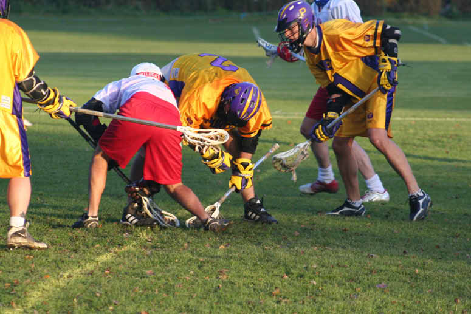

import Gallery from '~/components/Gallery.astro';

\
Mike Barrett faces while Dave Cluney looks for the loose ball

It was another beautiful day at Sandilands with the pitch in pristine
condition, and Purley needed to continue last week's resurgence. To start
possession was shared, but whereas Reading lacked penetration in attack,
Purley were more incisive, and it was only a matter of time before Purley
began to take control. Good team goals, including one by keeper Paul Terry,
gave Purley a comfortable 4-1 lead at quarter time.

The second quarter was even better for the home team. With Mike Barrett
winning the majority of the face-offs, and the Purley clear working well
and causing more than one offside, Purley had plenty of possession. Slick
ball movement and good work off the ball lead to a series of attractive
goals, and Purley completely dominated to give a half time score of 10-1.

At that stage Reading must have been concerned they were in for a drubbing,
but they used the half time break well to reorganise themselves. Better
riding, varying attacking formations, and more control on the ball all
helped in the second half. In contrast Purley already considered the job
done, and their intensity dropped considerably. Even so, Purley won the
third quarter 2-1, but Reading's dogged determination reaped it's rewards
as they won the last 3-0 to bring the final score to 12-5.

Purley will be more than happy with their first half performance, but
against the likes of Hampstead they will need to compete for the whole 80
minutes.

Goals (assists): Dave Arnot 3 (1), Tim Richmond 3 (2), Nigel Tasko 2, Paul
Terry 1, Graeme Holland 1 (1), Mike Barrett 1, Dave Cluney 1

<Gallery />

Photos by John Maynard.

