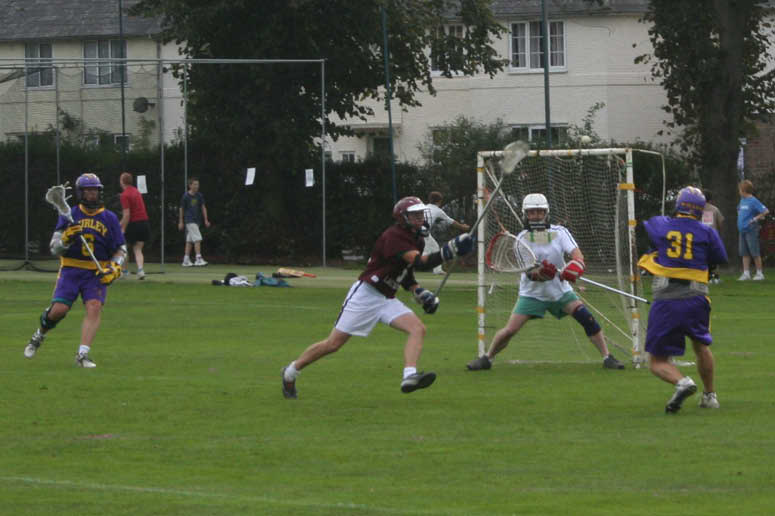

import Gallery from '~/components/Gallery.astro';

\
Timbo shoots into the top of the net

A balmy afternoon on a tremendously prepared pitch saw Purley take on
Spencer in their first game of the season. Purley welcomed new boys Rich
Kennedy and Nigel Tasko, who joined his brother Jamie, though as luck would
have it they won't be playing together as Jamie will be out until Christmas
following knee surgery. And speaking of knee surgery, Dave Arnot also
returns after 2 years out with a knee injury.

It became apparent early on that Spencer's stick skills and overall game
play had improved since last season, and it would be more of a
challenge - as was shown by their close 13-7 loss to Hillcroft last week.
Purley's lack of game action saw them go one-nil down early on, and they
struggled to level the scores 1-1 at quarter time.

The second quarter was also close, with Purley giving the ball away too
easily, and failing to use the ball well when they did get it. However they
did pull it together enough to pull out to a 6-2 lead, before loose marking
and lack of discipline in defence saw Spencer pull 2 goals back at the end
of the quarter to bring the score to 6-4.

The third quarter saw no improvement for Purley, as Spencer completely
dominated possession. But the Purley defence held firm, aided by some
excellent midfield defence from Graeme Holland, and Paul Terry being a wall
in the cage. At the other end Tim Richmond managed to get the only goal of
the quarter, leaving the game still in the balance for the final quarter.

It was the final quarter when the rust finally wore off. No more silly
mistakes, slick ball movement, and intelligent offensive team play lead to
seven goals in the quarter, to give a final score of 14-4.

Scorers: Tim Richmond 4, Dave Arnot 4, Nigel Tasko 2, Chris Spence 2, Mike
Barrett 1, Dave Cluney 1

<Gallery />

Photos by Jamie Tasko.

