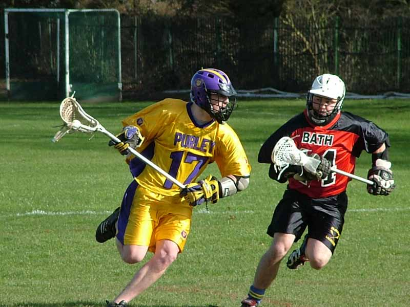

import Gallery from '~/components/Gallery.astro';

\
Jesse O'Hanley on the run

Purley had the perfect warm-up for next weeks flags final with a dominant
performance over Bath in the bright Spring sunshine as Addiscombe. From the
start the Purley attack moved themselves and the ball well, and with 6
goals in the first quarter and 7 in the second the game was over as a
contest by half time. With many well worked team goals, the best was
probably a fast break from the face-off where all 6 offensive players
touched the ball. Luke Smith won the face, pulled it back to Ian Nesbitt
who picked up the ground ball and fed Mike Barrett who was breaking down
the middle. Mike drew the defence and passed it to Jamie Tasko on the right
wing, who passed it on to Graeme Holland on the right post, and drawing the
keeper fed Matt Payne who had the easy job of slotting the ball home.

Bath did manage to get on the score sheet in the third quarter, but Purley
continued on from their first half performance to end comfortable 23-1
winners. The third quarter also brought the weirdest assist of the game, as
Jamie Tasko's shot rebounded off the keeper's box straight back into
Jamie's stick - and Jamie wasn't about to miss on the second attempt.

The return of Luke Smith at the face gave Purley plenty of possession for
some strange reason he had decided to get married in the middle of the
lacrosse season and had been on honeymoon. Congratulations Luke, and
married life obviously agrees with him as he notched up two well taken
goals.

And of course it's always nice to know that this was the third highest goal
difference against Bath - nice [stat to keep on your
website](https://bathlacrosse.com/historic-game-stats/) guys (and of course
Purley have the number 1 spot as well!).

Ref: Adam Crowe

Goals: Jamie Tasko 7, Jesse O'Hanley 6, Matt Payne 4, Mike Barrett 2, Luke
Smith 2, Graeme Holland 1, Dave Cluney 1

<Gallery />

Photos by Steve Cluney.

