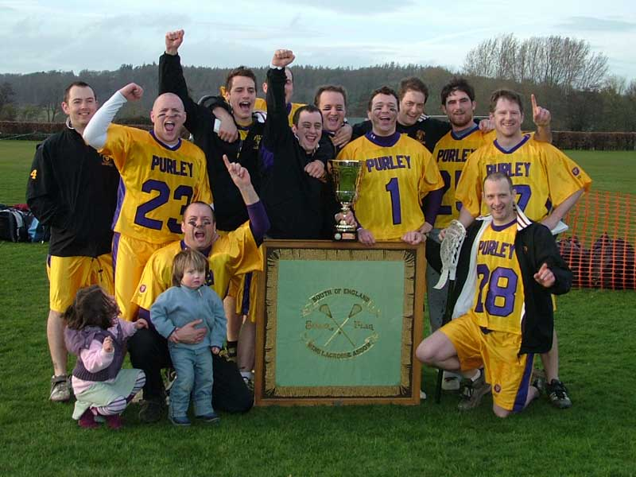

import Gallery from '~/components/Gallery.astro';
import { YouTube } from '@astro-community/astro-embed-youtube';

<YouTube id="eNFDIo7qUPw" class="four-by-three" />

While the crowd weren't treated to the display of free scoring, spectacular
lacrosse you might expect from these two sides, they were none the less
given a tense, thrilling contest which went down to the wire.

Purley weren't quite at full strength, with a couple of players missing
through work commitments, but were still quietly confident as they started
with the same 12 who had beaten Bath so convincingly last week. The only
other team worry was that Dean Searle was originally rostered to work today
and would have had to leave by 4pm. While this would normally have been
fine, the Senior Flags would start at 3pm to accommodate all the finals on
the day, so he'd only make the first half. Fortunately for Purley Dean's
boss allowed him the extra time, so thanks to him. And good job too, as
having that 4th long stick really makes a difference, and Dean's aggressive
defence helped keep the Hampstead offense under pressure, and resulted in
more than his fair share of turnovers.

The first three quarters followed pretty much the same pattern. Both sides
were guilty of turning over the ball far too easily, which helped keep the
score low, and until late in the game no more than a single goal ever
separated the sides. Hampstead's game plan seemed to be to dodge
one-on-one, but too many times they weren't looking for the pass when the
slide came, which allowed Purley to deal relatively easily with this threat
for the most part. Purley on the other hand tried to work the openings, but
while they moved the ball quickly round the outside, the movement off the
ball which had been so key in last week's goal fest was sadly lacking. This
made the offense somewhat toothless, and far too often attacks ended with
an easy turnover on a dodge into a well positioned defence, or a poor shot
from outside.

Purley took the lead 1-0 through Jesse O'Hanley, but after that is was
always Hampstead who were in front, only to be pegged back time after time
by Purley. Hampstead's first goal came from a defensive mix-up as Purley
lost the ball on their own man-up, and failed to register the fact that the
penalty was up as the Hampstead man stepped out of the sin bin unmarked,
which allowed them to get an easy fast break which Mike Noonan duly
converted. Hampstead then took the lead on a Dave Leach fast break. Paul
Terry made the initial save, only to see it rebound straight into Dave's
path, and with Paul out of position all he had to do was pick the ball up
and put it in the empty net. At quarter time it was 1-2 to Hampstead.

In the second quarter Purley did manage to get some periods of sustained
possession, but only managed a single goal when Mike Barrett fed Jamie
Tasko who was sneaking onto the crease from behind goal. However, they did
keep Hampstead out at the other end to bring the score to 2-2 at the half.
Hampstead scored early in the second half to restore their lead, but Purley
responded swiftly with a goal from Mike Barrett. Hampstead then scored
again in transition, which Purley eventually replied to through Jamie
Tasko, taking the three quarter score to 4-4.

So, everything to play for in the final quarter. Purley again started with
periods of controlled possession, but in contrast to previous quarters they
were now starting to move off the ball, and created a couple of good
chances before a sweet feed from behind found Mike Barrett with some space
and time up top, and Mike stuck the shot in low to give Purley a crucial
lead. The Hampstead attack caused Purley a couple of nervous moments before
Purley doubled their advantage, this time it was Mike Barrett who fed the
ball cross field to Graeme Holland on the left wing, and before the keeper
had set himself Graeme had drilled the ball past his left hip. Hampstead
then had a period of sustained pressure resulting in a couple of man-ups,
but they missed these vital opportunities to get back in the game as the
Purley defence held. With Hampstead now having to pressure the ball Purley
used the extra space well, and two more goals from Graeme Holland gave
Purley a comfortable cushion, and perhaps a rather flattering final score
of 8-4.

Purley will be grateful to their defence and keeper for keeping them in the
game in the first three quarters, but it was finally good team offense and
accurate shooting by Graeme Holland which gave Purley the victory.

Thanks to the men in the stripes, Simon Peach, Adam Crowe, and whoever the
third ref and CBO were, Reading for their usual fine job as hosts, and
Chris Terry for doing the video.

\
Back: Dean Searle, Graeme Holland, Dave Cluney, Mike Barrett, Matt Payne, Luke Smith, Paul Terry, Jamie Tasko, Ian Nesbitt, Jesse O'Hanley\
Front: Andy Booth (with Milla and Alex), Dave Slaughter

<Gallery />

Photos by Steve Cluney.

## Team Purley

Goal: Paul Terry \
Defence: Andy Booth, Dean Searle and Dave Slaughter \
Long-stick midfield: Ian Nesbitt \
Midfield: Mike Barrett (2), Dave Cluney, Jesse O'Hanley (1), Luke Smith \
Attack: Graeme Holland (3), Matt Payne and Jamie Tasko (2)
