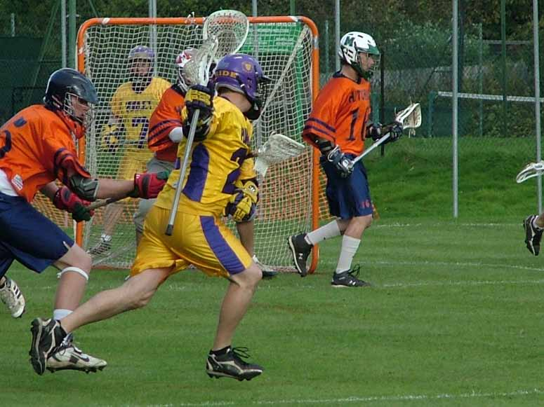

import Gallery from '~/components/Gallery.astro';

\
Mike Barrett drives for goal

For the first quarter this game looked like it would be as tight as the two
previous encounters between these two sides. The Purley attack was moving
the ball well, and went into a 0-1 lead, but this Hitchin side is always
effective and took the lead at 1-2 before Jamie Tasko tied it at 2-2.

It was the second quarter when the wheels really came off for Purley. With
Hitchin dominating the face-off they gained plenty of possession, and
Purley's lack of a fourth long-stick allowing Hitchin too much time in
attack, and they completely dominated the play scoring 5 goals in the
quarter to take the score to 2-7.

Purley rallied in the third quarter, with Jesse O'Hanley dropping back to
fill in as the fourth long stick to pressure the Hitchin attack, and a
change in the face-off helping them gain more possession. In the previous
quarters face-off man Luke Smith had often been winning the ball, but the
Hitchin wing men were always the ones picking up the ball. Purley switched
to using two long sticks on the wings, and this proved to be immediately
effective as Purley pulled the score back to 4-7. The Purley face-off was
also helped by an injury to the Hitchin face-off man who went down
awkwardly after a take-out, and had to be taken to hospital - so we hope he
is feeling better (we hear he is ok now, though will miss a few weeks).

However, despite pressuring the ball, Purley weren't able to put a dent in
the Hitchin lead, and for the remainder of the match the teams traded
goals, taking the final score to 6-10.

We'd also like to thank Adam the Canadian ref, who was officiating his
first game since moving to this country. He had a good game, so hopefully
we'll see more of him during the season.

Goals: Jamie Tasko 3, Chris Spence 1, Mike Barrett 1, Matt Payne 1

<Gallery />

Photos by Steve Cluney.

