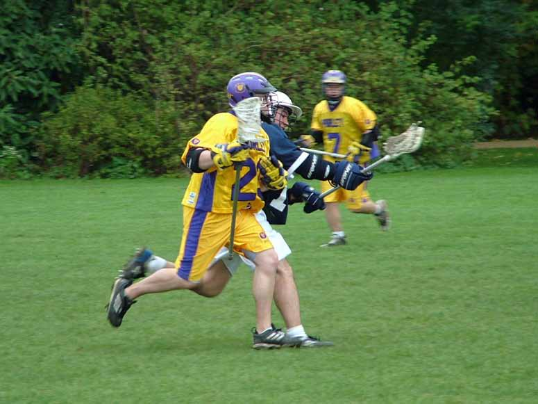

import Gallery from '~/components/Gallery.astro';

\
Oxford having trouble dealing with Graeme Holland

Oxford started brightly, taking the game to Purley with some sharp dodging
and quick shots, and initially this paid dividends, as they went up 1-0,
but Purley swiftly replied through Jesse O'Hanley. Learning their lesson
from last week's face-off problems Purley were again using two long sticks
from the wings. Luke Smith was dominating the face-off, unerringly pulling
the ball out to Ian Nesbitt on the wing time after time, which must have
gained Purley the ball 90% or more of the time. It was this combination
which led to Purley's next goal, as Nez gained possession from the face-off
and fired in a rocket. Oxford pulled back to 2-2, and the score was still
close with Purley leading 4-2 at quarter time.

In the second quarter Purley had the majority of possession, and started to
dominate. Oxford weren't helped by their keeper going off injured (though
he returned during the second half). Nez decided to give the stand-in
keeper an appropriate welcome, as on the fast break he launched a shot from
the restraining line which hit the keeper right in the face mask, rocking
his head back, and the ball ended up in the back of the net. Purley
continued to increase their lead, ending the half 8-2 up.

In the third quarter Oxford again started brightly, and managed to pull the
score back to 8-4. At that point it looked like Oxford might make this a
tight game, but after that is was all Purley, as they made their superior
possession count to take the three quarter score to 11-4, and completely
dominated the last quarter with a clinical display resulting in 7 goals,
including another for Nez, and one for the other long stick midfielder
Denham Pope. Final score to 18-4.

Thanks to Jon Harrop for his usual consummate performance in the stripes.

Goals: Jesse O'Hanley 6, Jamie Tasko 4, Ian Nesbitt 3, Graeme Holland 2,
Luke Smith 1, Matt Payne 1, Denham Pope 1

<Gallery />

Photos by Steve Cluney.

