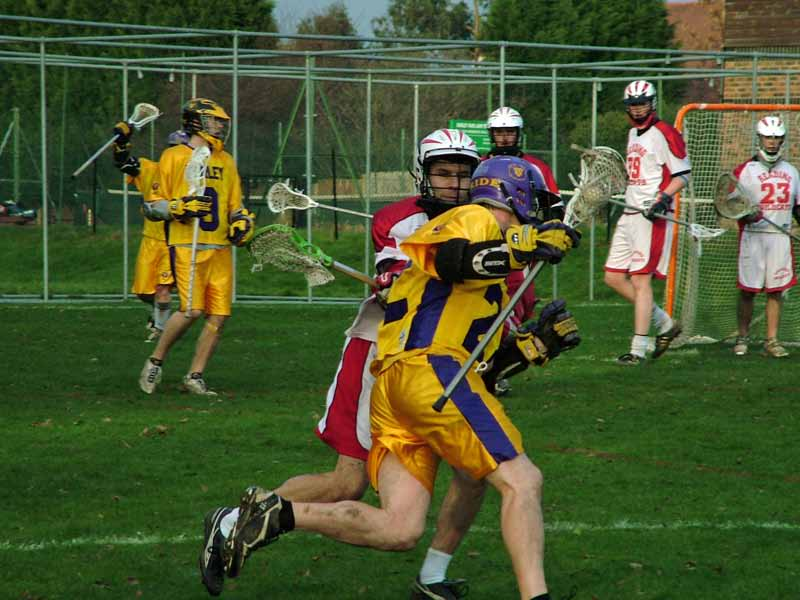

import Gallery from '~/components/Gallery.astro';

\
Jamie Tasko drives for goal

For the first half this looked like it could be a close match. Despite
periods of controlled possession for Purley, the Reading defence were
making good scoring opportunities hard to come by, and with the Reading
keeper pulling off some excellent saves the Purple and Gold were finding it
hard to keep the scoreline ticking over. Purley were never really in any
trouble though, as at the other end the Purley defence were handling the
Reading attack with ease, and with Reading turnovers allowing Purley to
capitalise on fast breaks they started edging out a lead with the score at
3-0 at quarter time and 5-0 at the half.

The second half was a vast contrast to the first as Purley started to wear
down the Reading defence, and smart passing moves were increasingly finding
free men close in on goal, which was duly capitalised on by Dan Heighway
who top scored with 6. Five goals in the third quarter and 8 in the last
blew Reading away. Final score 18-4.

Purley will also be pleased by the first performance this season of new
recruit Adam Culling, who showed he wasn't out of place in a Premiership
side, and Mike Barrett continues his good scoring form this season with 4
well taken goals.

Ref: Trevor Rogers

Goals: Dan Heighway 6, Mike Barrett 4, Jamie Tasko 3, Jesse O'Hanley 3,
Chris Spence 2

<Gallery />

Photos by Steve Cluney.

