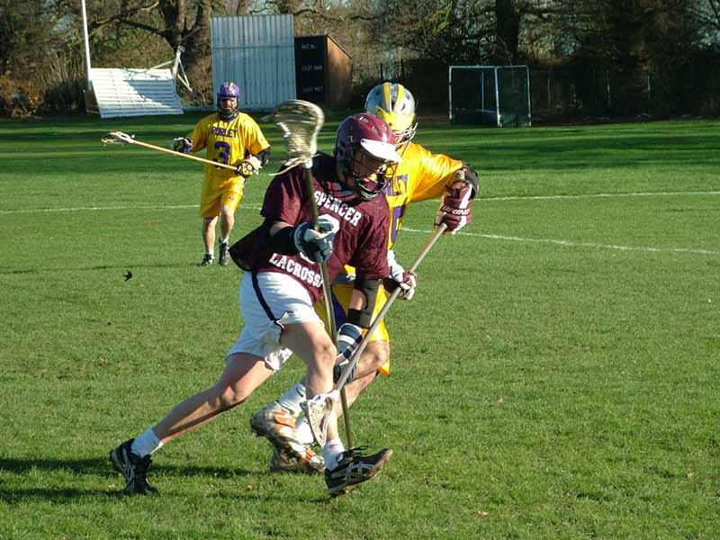

import Gallery from '~/components/Gallery.astro';

\
Battle of the Long-stick middies - Mike Nesbitt checks Alan Keeley

In a complete reversal of their previous meeting this season, it was Purley
who opened a big gap early in the game, with a 7-0 lead mid way through the
second quarter. Spencer did battle back with a couple of goals to take the
half time score to 8-2.

Control of the ball in attack gave Purley prolonged periods of pressure on
the Spencer goal, and good movement on and off the ball regularly opened up
the Spencer defence, and kept the score ticking over nicely - and ensured
the goals were spread around the team, as eight different names made it
onto the score sheet. Six goals in each of the remaining quarters saw
Purley ease through to the next round of the Flags with a 20-4 win.

Ref: Simon Peach

Goals: Jesse O'Hanley 5, Nick 4, Mike Barrett 3, Matt Payne 2, Jamie Tasko
2, Chris Spence 2, Graeme Holland 1, Dave Cluney 1

<Gallery />

Photos by Steve Cluney.

