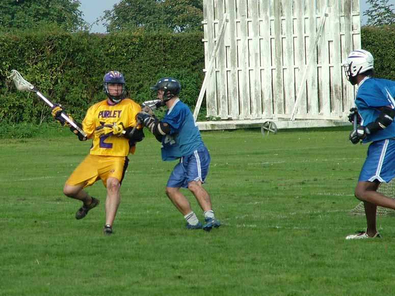

import Gallery from '~/components/Gallery.astro';

\
The Blues D tries to keep Mike Barrett out

The Blues started out strong, obviously confident after the previous weeks
one goal loss to Hampstead, whereas Purley showed signs of early season
rustiness with missed passes and easy turnovers. For the first ten minutes
play was pretty even, but the Blues were more decisive in attack, and only
a string of good saves from keeper Paul Terry kept them out. Purley scored
first, but the Blues soon levelled with a sweet shot into the top right
corner. However, after that the Purley side settled, and with good movement
in attack and slick ball movement they cruised to a 6-1 lead at the
quarter, and 10-1 at the half.

At the beginning of the second half the Blues stepped it up again, and for
the first five minutes played nearly constantly in attack, but the Purley
defence was working well and they limited the Blues opportunities to low
percentage shots. After weathering the storm, Purley scored on almost their
first possession of the half, and then continued on from where they had
left off in the first half to finish with a 23-1 victory.

New American coach Ian Nesbitt looks to be fitting well into the Purley
defence, and this victory will be especially sweet as Ian shares a house
with the 2 Blues coaches, so it looks like he'll have the bragging
rights - at least until the two sides next meeting.

Goals: Jamie Tasko 6, Jesse O'Hanley 5, Dan Heighway 4, Mike Barrett 4,
Graeme Holland 1, Matt Payne 1, Dave Cluney 1, Chris Spence 1

<Gallery />

Photos by Steve Cluney.

