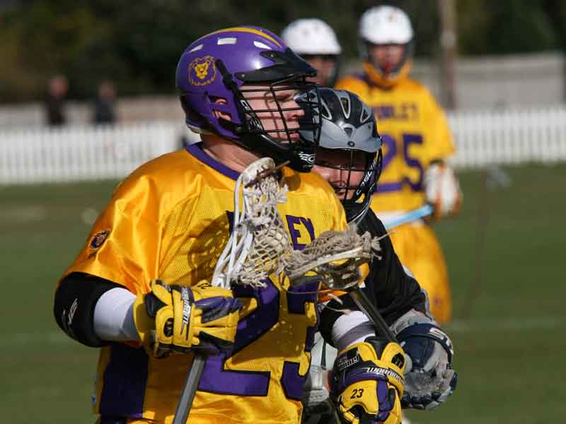

import Gallery from '~/components/Gallery.astro';

Excellent shot of Graeme Holland protecting the ball under pressure

Final score: 18 - 0 \
Goals: John Maydick 4, Dennis McKenna 3, Jamie Tasko 2, Dan Heighway 2,
Bill Laidler 2, Graeme Holland 1, Matt Payne 1, Mike Barrett 1, Jesse
O'Hanley 1, Own goal 1

## Other Photos

<Gallery />

Photos by Steve Cluney and ?.

