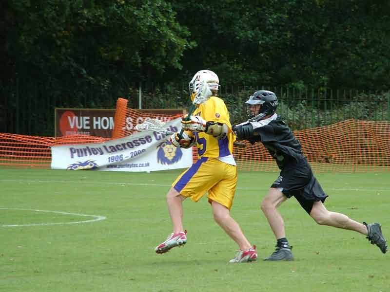

import Gallery from '~/components/Gallery.astro';

\
Dennis McKenna rounds his man and winds up for a tight angled shot

A fine sunny day and a pristine pitch at Addiscombe greeted both sides in
their first ever encounter in this pre-season friendly. And it became
quickly apparent that Purley needed the match practice, as they
under-performed at both ends of the field. In fact the only area where
Purley excelled was in the centre, where new recruit Bill Laidler won
almost every face-off.

It was East Grinstead who opened the scoring to take a 0-1 lead, but Purley
soon levelled, and barring a brief period at 3-3 they were always in front.
However the could never put any distance between the teams, with their lead
only ever as high as 2 goals. It was a story of East Grinstead punishing
any Purley mistakes with good team play, unerringly finding the open man on
any missed slides or defensive assignments, followed by Purley restoring
their advantage with moments of individual flair, or more rarely with brief
glimpses of their usual class.

If Purley continue like this next week then they could be in trouble
against a re-vitalised Spencer. Final score 8-7.

Goals: Mike Barrett 3, Bill Laidler 3, Matt Payne 1, Dennis McKenna 1 \
Ref: Simon Peach

<Gallery />

Photos by Steve Cluney.

