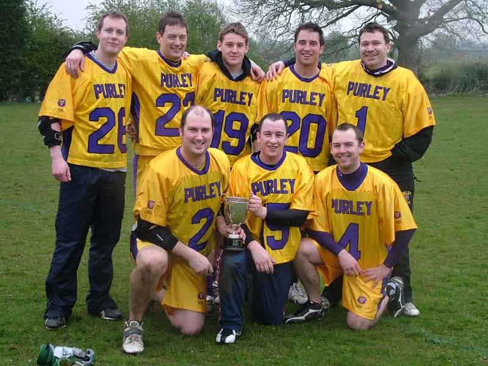

\
Back: Chris Spence, Jamie Tasko, Bill Laidler, John Maydick, Paul Terry \
Front: Mike Barrett, Matt Payne, Dean Searle

| Stage | Opposition | Result | Scorers |
| ----- | ---------- | ------ | ------- |
| Round robin | Hitchin | 4 - 2 | Bill Laidler 3, Mike Barrett |
| | East Grinstead | 4 - 3 | Chris Spence 2, Mike Barrett, Matt Payne |
| | Reading | 5 - 1 | John Maydick 3, Bill Laidler, Jamie Tasko |
| Semi-Final | Walcountian Blues | 4 - 3 | Mike Barrett 2, John Maydick, Bill Laidler |
| Final | Swansea | 9 - 4 | Bill Laidler 3, John Maydick 3, Matt Payne 2, Mike Barrett |

Goal totals: Bill Laidler 8, John Maydick 7, Mike Barrett 5, Matt Payne 3,
Chris Spence 2, Jamie Tasko 1

## Final Report

Both teams were undefeated coming into the Final, but Purley really turned
it on in first half to build an unassailable 7 - 3 lead. John Maydick in
particular was on fire with some stunning ripping shots in and around the
goal; the keeper was lucky he didn't manage to get in the way of some of
them.

Photo by Steve Cluney.

