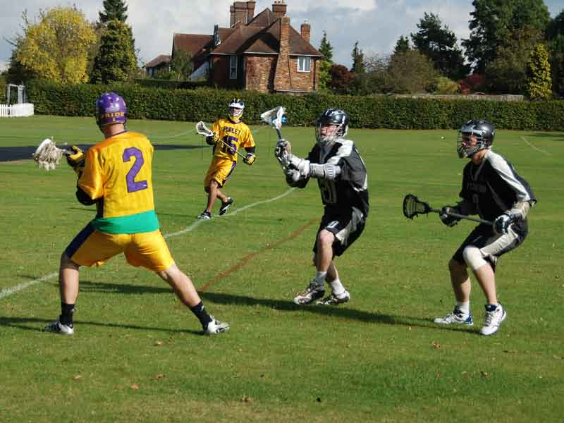

import Gallery from '~/components/Gallery.astro';

\
Mike Barrett looks for the pass to Dave Bennett

It was a wonderful Autumn day at Addiscombe, and it was Purley who started
brightly as they controlled much of the early possession. Patient offence
led to the opening goal from Matt Payne, but EG replied quickly to level
1-1. Purley then started to dominate, and 2 goals from Dave Bennett took
the quarter time score to 3-1.

After a comfortable start, Purley then just seemed to put it into reverse.
Bad choices and poor execution in offence started to give the ball away too
easily, and the usually frugal Purley defence lost concentration allowing
the EG attackers to ghost free into excellent scoring positions, which cost
a couple of cheap goals. Everything seemed to be going wrong, and by half
time EG had taken the lead 5-6.

Purley managed to steady the ship in the third quarter, though they hadn't
regained their 1st quarter form. The Purley defence reasserted themselves,
keeping EG to a single goal, but despite gaining far more possession the
attack was still lacking a killer instinct, with the only goal coming from
Jamie Tasko to keep Purley in touch at 5-6.

After a tense start to the final quarter, it was Rob Clark who claimed the
vital first goal to level the scores at 6-6. The more the quarter went on
the better Purley started to play, until inevitably Mike Barrett put Purley
7-6 in front. With the lead gone, and the clock ticking down, EG had to
force the play at the attacking end, which caused a couple of scares, but
they also had to pressure the ball in defence, and it was Wes Wilkinson who
used the extra space well to take the score to 8-6 and settle Purley's
nerves, before Mike Barrett put the game completely out of reach taking the
final score to 9-6.

Purley will be well pleased with the first and last quarters, but will need
to work on their intensity to stop a re-occurrence of the second quarter
performance. Also on the down side was a rather nasty fall by Dan Afoke.
The docs seem to think everything is OK, and he landed on his head, so
there's nothing there to damage anyway. Hope you feel better soon.

Goals: Mike Barrett 3, Dave Bennett 2, Matt Payne 1, Jamie Tasko 1, Wes
Wilkinson 1, Rob Clark 1 \
Ref: Simon Peach

<Gallery />

Photos by Steve Cluney.

