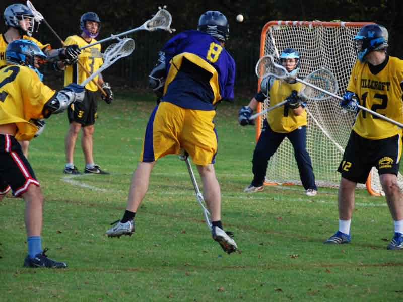

import Gallery from '~/components/Gallery.astro';

\
Guy Francis sends in a shot

Hillcroft have been much improved this season, however their hopes of an
upset were severely dented as they were missing several key players,
including their entire first string attack. Purley too were missing a
couple of key players. Last season's MVP Mike Barrett grappled with the
idea that he should ensure his keys are not inside when the front door
shuts. Andy Booth was also unable to play, but where he would be missed on
the field his presence was felt on the side line managing the team (and
getting himself a technical foul!). Despite the poor weather at the start
of the day, the afternoon had cleared allowing for great lacrosse playing
conditions.

Purley started strongly, working the ball round the Hillcroft goal, and
quickly took a 2-0 lead through 2 goals from Dave Bennett. But then they
started to waste possession in attack, which allowed Hillcroft to regroup
and enjoy several sustained periods of possession, which allowed them to
pull a goal back. Purley reacted through Jamie Tasko to finish the quarter
3-1.

It was more of the same attacking capabilities of Purley in the second
quarter where they were able to play through the Hillcroft defence and
extend their lead through Dave Bennett again. However, Purley were still
giving Hillcroft plenty of possession because of easy turn-overs and coming
up second best from the face-off. The pressure on the Purley defence
eventually told as Hillcroft brought the score to 4-2. Purley then managed
to work themselves a number of man-up plays; both from well worked
clearances from goalkeeper Paul Terry drawing the offsides call, and in
attack Matt Payne drawing fouls from the Hillcroft defence. This gave the
opportunity for the two attack men Matt and Jamie to convert, ending the
half 6-2.

Whilst Purley had built a workable lead in the first half, their defence
had been overworked due to the amount of possession they allowed Hillcroft,
caused mainly by turn-overs, but also by Hillcroft winning most of the
face-offs. The timely arrival of Rob Clark proved to be the turning point
in that battle, and indeed the match. Rob's face-off expertise saw Purley
coming up with the ball from the face the vast majority of the time, and
this gave Purley a solid base to mount their attack from, and as the
turn-overs also dried up it give their defence a chance to rest. Jamie
Tasko opened the scoring for the half with a close in shot. A feed from Guy
to a well timed cut from Andy Fernando followed suit. Rob Clark was able to
add to his day by scoring from the face, and a behind the back shot from
Dave Bennett, and goals from Jamie and DC ended the third quarter 13-2.

Hillcroft kept their drive in the 4th quarter despite the goal difference,
and continued to battle on. Purley's defence continued to deny the
Hillcroft attack, and a knock down from Dean Searle gave way for the D-man
to make a fast break up field. He shoots, he doesn't score. Or does he? The
shot flies up from the keeper's helmet, only to hit the deck and bounce in.
As Dean says, they all count. Hillcroft's commitment then paid off with a
well worked goal, however goals from Purley's Dave Bennett, DC and Jamie
wrapped up the end of the final quarter 18-3.

Goals (assists): Dave Bennett 5, Jamie Tasko 4 (2), Dave Cluney 4, Matt
Payne 2 (3), Rob Clark 1, Andy Fernando 1, Dean Searle 1, Guy Francis (1) \
Ref: Simon Peach, CBO: Roger Govus

<Gallery />

Photos by Steve Cluney.

