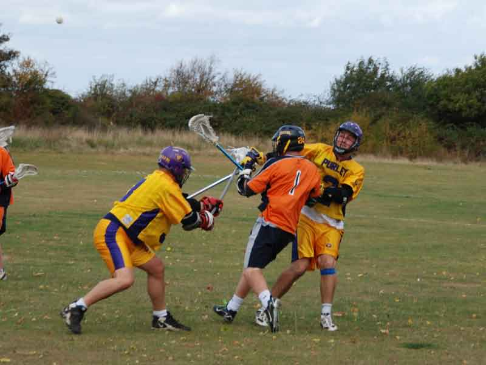

import Gallery from '~/components/Gallery.astro';

\
Spot the ball as Andy Booth slides to help out Mike Barrett

The start of the 2009-10 league campaign saw Purley heading into the wilds
of Hertfordshire to play Hitchin. Purley's 17 man squad saw the long
awaited return of Andy Booth, the first league appearance of new American
coach Dave "Gordie" Bennett, and Paul Terry returning tanned and refreshed
from his honeymoon (congratulations to him and Helen). All in all, the
Purley team had a good mix of experienced players laced with a number of
younger players.

Playing conditions were good, with a hint of gusty wind. Purley put into
practice their summer training sessions, which paid off with two goals
coming from Dave "Gordie" Bennett. Continued possession saw Purley ending
the first quarter 3-1 up.

It was more of the same possession, quick passing and off the ball movement
from Purley in the second quarter, with Wes enjoying his freedom behind the
cage, moving, passing, and feeding the cutters well. Goalkeeper Paul
Terry's precise passing and Purley's well worked clear led to a number of
off-sides by Hitchin, and Purley were able to capitalise on the resulting
man-ups to finish off the second quarter with a comfortable 7-2 lead.

A confident Purley side came out for the 3rd quarter, extending their lead
by 1 goal coming from Guy. For the first 10 minutes of the quarter Purley
continued to dominate possession, and really should have put the game
comfortably beyond Hitchin's reach, but though they created many scoring
opportunities they failed to take any of them. This allowed Hitchin to
respond back with 3 goals, generated from good movement off the ball for
which they are known, before Mike Barrett added to his already growing
tally to give Purley a 9-5 three quarter time lead.

Final quarter and again Purley started off with Mike Barrett scoring to
give a lead of 5 goals. Hitchin rallied together at this point and started
to eat away at Purley's lead. Despite Jesse and Dave "Gordie" Bennett both
hitting the pipe, Purley struggled to kill off Hitchin's momentum, and the
tension grew as Hitchin pulled the score to 10-9 in the closing stages. Rob
Clark had been having a great day facing off, winning the lion's share of
possession, and this became crucial towards the end of the quarter. A
face-off win from Rob, and a quick string of passes saw Jesse firing one in
off the pipe to end the match with a Purley win 11-9.

A good work rate and team effort from all for Purley's win, though they
made it difficult for themselves by not closing out the game at the
beginning of the second half, which allowed Hitchin to fight back well
towards the closing stages.

Goals: Mike Barrett 5, Dave "Gordie" Bennett 3, Jesse O'Hanley 1, Dave
Cluney 1, Guy Francis 1 \
Thanks to Ref: Hazel; CBO: Sevan

<Gallery />

Photos by Steve Cluney.

