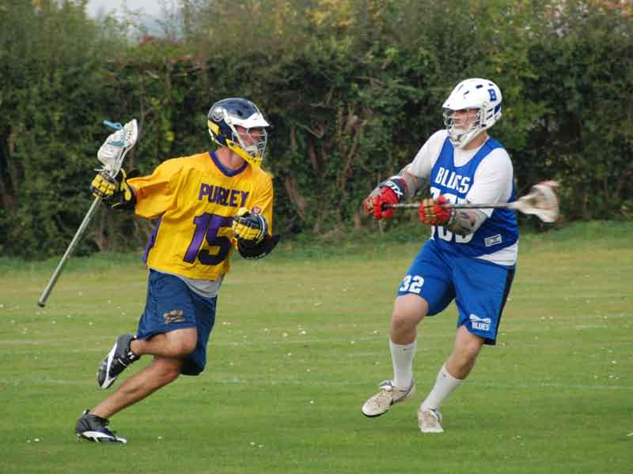

import Gallery from '~/components/Gallery.astro';

\
Dave 'Gordie' Bennett looks to drive

It was bright sunny day at the Blues, great playing conditions, and with a
number of other matches being played also a great atmosphere. In typical
pre-season friendly form both teams were markedly below strength; Purley
were missing their complete attack line (AWOL), 'keeper (honeymoon!), and
captain (swollen eye from a bee sting), and the Blues were missing at least
3 key personnel and their 1st choice 'keeper.

For Purley this match saw the first appearances for Dave Copple in defence,
and Dave "Gordie" Bennett, Purley's new LDO (that's coach to you and me).
Naturally, being on a team with so many Daves already (and none of them
actually called Dave) the first order of the day was to give the new LDO a
nickname - Gordon Bennett, or Gordie for short (non UK readers might want
to Google that reference).

At the start of the first quarter Purley moved the ball quickly and
efficiently around the pitch, which led to a 2-0 lead. However the Blues
responded leaving the first quarter at 3 a piece in what was becoming a
very competitive game.

The Blues came out strong in the second quarter, forcing stand-in Purley
'keeper Riaz to make some big saves. The Blues continued to pass around the
Purley defence which paid off with 4 goals, before a solo move behind goal
allowed Dave Cluney to feed Dan Afoke on the crease, bringing the halt time
score to 4-7.

The Blues dominated the start of the third quarter taking a lead of 4-10
lead, but the Purley team pulled together under Dave Cluney's leadership,
and goals from Rob Clark and DC reduced the deficit to 7-10 by the end of
the third quarter.

In the final quarter it was down to Purley to take the game to the Blues,
but despite a hard effort on the field from Purley, and goals from Bennett,
Clark and Cluney it was not enough. Final score 10-15.

Despite the result, the relatively inexperienced Purley team had much to
take from this encounter with the Blues, who are tipped as a serious
contender for honours this season. It was a game which saw many of the less
experienced players get some quality game time (and they all stepped up to
the mark), allowed Dave "Gordie" Bennett to settle into the team, and
brought a superb Captain like performance from DC. Special mention to Riaz
from Maidstone for stepping into the pipes last minute for Purley and
having a fantastic game.

Goals: Dave Cluney 4, Dave "Gordie" Bennett 3, Rob Clark 2, Dan Afoke 1 \
Ref: Blues x2

<Gallery />

Photos by Steve Cluney.

