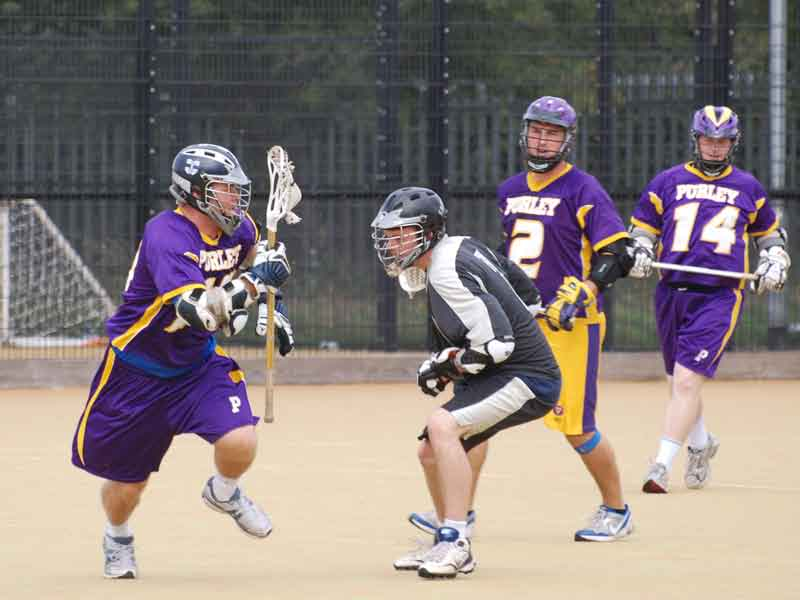

import Gallery from '~/components/Gallery.astro';

\
Think Ryan McDonald's sold that face dodge...

Saturday 11 September saw the first friendly of the 2010/11 Purley Lacrosse
season, and it commenced with a home game (held at Monk's Hill Sports
Centre) against East Grinstead, now becoming a regular pre-season fixture.
We should start with a welcome to a new keeper Rick Bone and our new LDO
Ryan McDonald. As many of you will know Paul Terry has started his "arduous
married life" by setting off with his new "better half" on a world tour for
the next year, so we are delighted to be able to welcome Rick an
experienced keeper from "up north" into the team. Also debuting was Ryan
McDonald, our new LDO midi, who hails from across the pond in New
Hampshire.

So what of the game, well first we should thank Dave Slaughter and Andy
Booth who each refereed a half each of the game. Purley started slowly
trying to blend the squad into a team and we conceded two early goals before
getting into our scoring stride, and it was Club Captain Mike Barrett who
opened the club's account for the season to pull a goal back. Not to be
outdone club Vice Captain Dave Cluney then put one away to bring the scores
level at 2-2, Wes Wilkinson then gave us the lead for the first time at
3-2. The game continued to ebb and flow with a 3-3 score at the end of the
first quarter. Fortunately we had a strong defence line up on hand to
steady the team with Dean Searle, Andy Booth, Hamish Dickson, Dave Hudson,
and Dave Slaughter all putting in appearances.

Quarter 2 started better with first Jamie Tasko adding to our lead and then
LDO Ryan McDonald netted a pair, so at the end of the first half the score
was 6-4. Quarter 3 saw Purley step up a gear as Dave Cluney went on a
personal goal scoring rampage scoring 3 of the next 4 Purley goals, and
even managed to break an opposition long stick with his arm in the process
(an expensive start to the season for one defender). Purley took the
quarter 4-1 giving the team a 10-5 lead at the end of the third quarter.
Continued pressure in the final quarter from the team, with the defence
keeping a clean sheet in the final quarter saw the team cruise to a 13-5
final victory, a reasonable start to the new season.

Team: Rick Bone, Dave Slaughter, Andy Booth, Dean Searle, Dave Hudson,
Hamish Dickson, Mike Barrett (3), Andy Fernando, Ryan McDonald (2), Dave
Cluney (5), Wes Wilkinson (1), Andy Davies, Jamie Tasko (2) \
Ref: Dave Slaughter/Andy Booth

<Gallery />

Photos by Steve Cluney.

