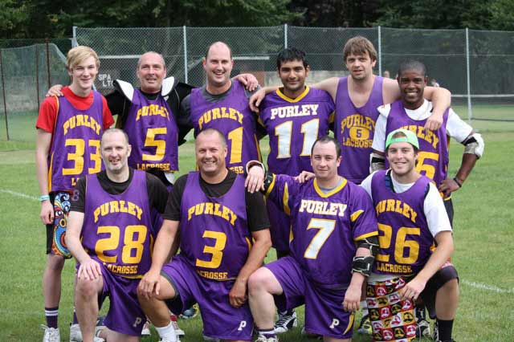

\
Back: Sam Baranowski, Justin Baranowski, Mike Barrett, Andy Fernando, Dave
Hudson, Harrison Parr \
Front: Dave Slaughter, Andy Booth, Matt Payne, Gus

Despite ominous forecasts earlier in the week, bright sunshine greeted the
33 teams competing for the Bath 8s. Purley were looking pretty strong, with
new LDO Harrison Parr making his first appearance, and their chances were
bolstered further when they managed to snag the Blues LDO keeper Gus.

A favourable draw for Purley allowed them to miss all the Northern teams in
the group stages, and comfortable victories over SOAP Stars, Reading, East
Grinstead, Bath Exiles, Cheltenham Cougars and Cardiff University allowed
them to qualify in 3rd place for the quarter finals.

The quarter-final against Manchester Waconians was a tight match. Purley
repeatedly went a goal up, only to be pegged back each time, and at
full-time the scores were level. Into extra time then, and the pattern
repeated itself as Purley scored first, but it was sudden-death now, so on
to the semis.

The semi against Wilmslow was a reversal of the previous game, as now it
was Wilmslow who repeatedly went ahead, only for Purley to claw their way
back into it, and once again the game went to extra-time. However again it
was Purley who managed to get the golden goal, so it was on to the final.

Repeating the pattern, the final against Brooklands was again a tight
affair, with the lead swapping hands, but Brooklands generally in the
ascendancy. With 2 minutes left Brooklands were 1 goal up, with Purley
pressing for the equaliser. With 15 seconds left Purley scored, and it
looked like it was going to be yet another game going to extra time, but
Brooklands weren't done, and caught Purley napping at the restart to score
the decisive goal with 8 seconds left.

A disappointing end to the day, but all in all Purley will be pretty
satisfied with the day's performance.

Thanks to all at Bath for the magnificent organisation, the referees, and
congratulations to Brooklands on their win.

Photo by Diana Baranowski.

