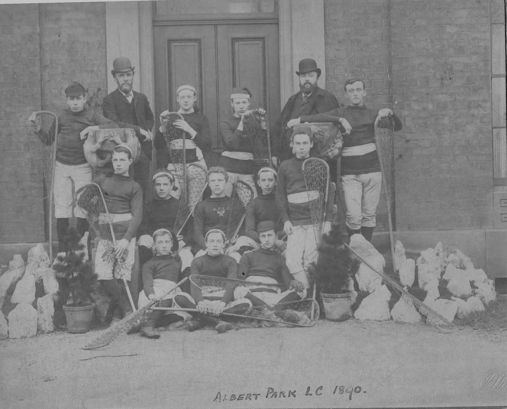
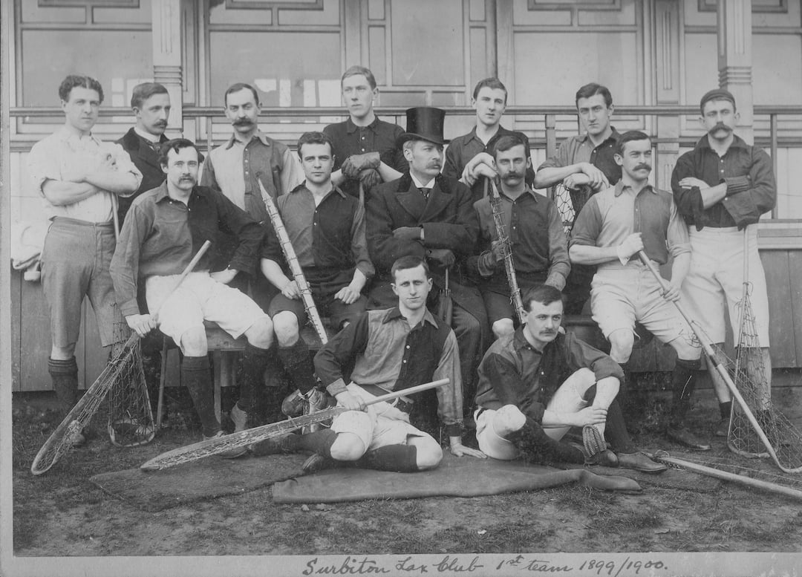

## Albert Park Lacrosse Club 1890

\
*Back:* J.Wilkie, Mr. Birch, Rigby, Beardmore, Mr. Cochrane, Pearson.\
*Centre:* F.Allison, E.Baird, W.M.Birch, G.Wilkie, F.Nightingale.\
*Front:* H.Lees, D.Moreton, J.Vick.

Presented to Purley, 1949, by Mr. Vick.

## Surbiton 1st Team 1899/1900

\
*Back:* Sargent, C.E.Thomas, H.E.Byers, S.O.Pugh, C.Clarke, S.L.Clark, F.Battersby\
*Centre:* A.Clarke, T.Sargent, ?, G.M.Burd (Captain), E.C.Milner\
*Front:* J.Vick, ?
